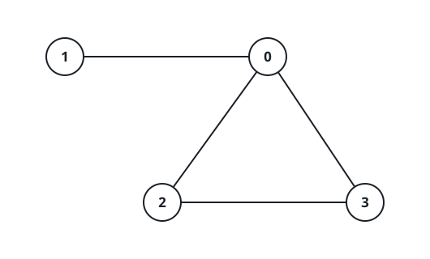

# A Graph With These Degrees

## Description

Each vertex `i` of an undirected graph on `n` vertices (numbered `0` through
`n - 1`) has a wish: `degrees[i]` neighbors. The graph must be simple — no
edge joins a vertex to itself, and any two distinct vertices are joined by
at most one edge — and vertex `i` must end up with exactly `degrees[i]`
edges attached.

Decide whether at least one simple graph can satisfy every vertex's wish.

Return `true` when some simple graph realizes the whole degree list, or
`false` when no arrangement can.

### Example 1



```text
Input: degrees = [3,1,2,2]
Output: true
Explanation: Take the edges (0,1), (0,2), (0,3) and (2,3): vertex 0 touches
three of them, vertex 1 one, and vertices 2 and 3 two each — exactly the
requested degrees.
```

### Example 2

```text
Input: degrees = [1,1,1,1]
Output: true
Explanation: Pair the vertices into two disjoint edges, say (0,1) and
(2,3); every vertex then has exactly one neighbor.
```

### Example 3

```text
Input: degrees = [3,3,3,1]
Output: false
Explanation: Vertices 0, 1 and 2 would each need to reach all three other
vertices, which already forces two edges onto vertex 3 — but it is allowed
only one. The sum of the degrees is even, yet no simple graph fits.
```

### Constraints

- `1 <= n == degrees.length <= 10⁵`
- `0 <= degrees[i] <= n - 1`

## Hints

### Hint 1

The degree sequence of any simple graph passes the Erdős–Gallai test: the
degrees sum to an even number, and after sorting them in non-increasing
order, every cut `k` obeys `d[1] + ... + d[k] <= k*(k-1) + min(d[i], k)`
summed over the remaining `i > k`. The test is an if-and-only-if.

### Hint 2

Prefix sums over the sorted degrees give both sides of every cut in
constant time, and a pointer that only moves left tracks how many tail
entries still exceed `k`, turning the `min` terms into a closed form.
