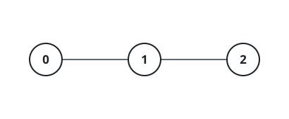
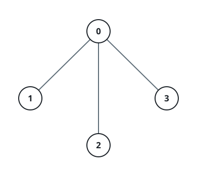

# Groupmate Distances In A Tree

## Description

A tree with `n` nodes numbered from `0` to `n - 1` is handed over as an edge
list: an array `edges` of length `n - 1`, where `edges[i] = [uᵢ, vᵢ]` joins
nodes `uᵢ` and `vᵢ`. Every node also carries a label — an integer array
`group` of length `n` gives `group[i]` for node `i`.

Call two nodes label mates when they carry the same label, and define their
distance as the number of edges along the unique path that links them in the
tree. Return the sum of distances over every unordered pair of distinct
label mates.

### Example 1



```text
Input: n = 3, edges = [[0,1],[1,2]], group = [1,1,1]
Output: 4
Explanation: Every node shares label 1, so all three pairs are label mates.
Nodes 0 and 2 sit two edges apart; the other two pairs are adjacent. The
total is 1 + 1 + 2 = 4.
```

### Example 2

```text
Input: n = 4, edges = [[0,1],[1,2],[2,3]], group = [5,5,1,5]
Output: 6
Explanation: Nodes 0, 1 and 3 carry label 5. Their pairwise distances are
1 (0-1), 2 (1-3) and 3 (0-3), adding to 6. Node 2 is the only label-1 node
and pairs with nobody.
```

### Example 3



```text
Input: n = 4, edges = [[0,1],[0,2],[0,3]], group = [1,1,4,4]
Output: 3
Explanation: Label 1 owns nodes 0 and 1, one edge apart. Label 4 owns nodes
2 and 3, two edges apart. The two contributions add to 3.
```

### Example 4

```text
Input: n = 5, edges = [[0,1],[0,2],[1,3],[1,4]], group = [6,6,2,2,2]
Output: 9
Explanation: Label 6 pairs nodes 0 and 1 at distance 1. Label 2 owns the
trio {2, 3, 4}: the two pairs involving node 2 each span 3 edges and the
pair (3, 4) spans 2, contributing 8. The total is 1 + 8 = 9.
```

### Constraints

- `1 <= n <= 10⁵`
- `edges.length == n - 1`
- `edges[i] = [uᵢ, vᵢ]`
- `0 <= uᵢ, vᵢ <= n - 1`
- `group.length == n`
- `1 <= group[i] <= 20`
- The given edges always form a valid tree.

## Hints

### Hint 1

Traverse the tree postorder and tally, for every subtree, how many of its
nodes carry each label.

### Hint 2

An edge contributes `subtree_count * (total_count - subtree_count)` — that
many same-label pairs cross it.

### Hint 3

Add those products over every edge and every label.
