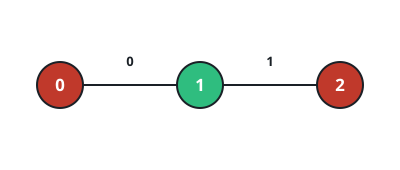

# Recoloring A Tree, Edge By Edge

## Description

A tree has `n` nodes numbered `0` through `n - 1`, given as a 2D integer
array `edges` of length `n - 1` in which `edges[i] = [ai, bi]` joins
nodes `ai` and `bi`.

Each node also carries a color, one character of a binary string:
`start[x]` is the color node `x` shows now, and `target[x]` is the color
it must show in the end.

A single operation picks one edge index `i`, spanning nodes `u` and
`v`, and flips both of its endpoints at once — the colors of `u` and of
`v` each invert, `'0'` turning into `'1'` and `'1'` into `'0'`.

Turn `start` into `target` using as few operations as possible, and
return the indices of the edges you used, listed in increasing order.
If `target` can never be reached, return an array whose only element is
`-1`.

### Example 1



```text
Input: n = 3, edges = [[0,1],[1,2]], start = "010", target = "100"
Output: [0]
Explanation: Using edge 0 flips the colors of nodes 0 and 1 together,
turning "010" into "100" in a single operation.
```

### Example 2


```text
Input: n = 7, edges = [[0,1],[1,2],[2,3],[3,4],[3,5],[1,6]], start = "0011000", target = "0010001"
Output: [1,2,5]
Explanation:
Edges 1 and 2 meet at node 2, so together they flip nodes 1, 2, and 3
with node 2 restored — net effect, node 1 comes on and node 3 goes
off. Edge 5 then flips nodes 1 and 6, sending node 1 back off and
node 6 on. The string now reads "0010001", exactly the target.
```

### Example 3


```text
Input: n = 2, edges = [[0,1]], start = "00", target = "01"
Output: [-1]
Explanation: Every operation flips both ends of the only edge, so the
two colors always move together. "00" can therefore never become
"01", and [-1] is the answer.
```

### Constraints

- `2 <= n == start.length == target.length <= 10⁵`
- `edges.length == n - 1`
- `edges[i] = [ai, bi]`
- `0 <= ai, bi < n`
- `start[i]` is either `'0'` or `'1'`.
- `target[i]` is either `'0'` or `'1'`.
- The input is generated such that `edges` represents a valid tree.

## Hints

### Hint 1

Settle the tree from its leaves inward — a depth-first pass fixes an
order in which every node is handled after its whole subtree.

### Hint 2

Root the tree anywhere and track the flip parity that has already
reached a node from the edges taken above it.

### Hint 3

When a node's subtree is finished, its own parity can only still be
repaired by the edge to its parent: if the node still mismatches, take
that edge and hand the parity up.

### Hint 4

Parity left over at the root has nowhere left to go — return `[-1]`;
otherwise emit the taken edge indices in ascending order.
