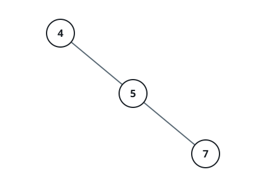
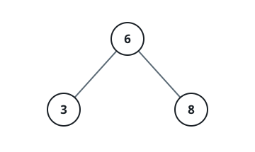
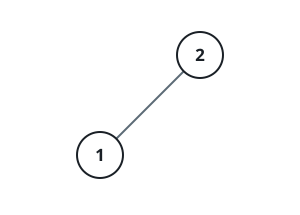

# The Median Value On One Tree Level

## Description

You are given the root of a binary search tree and an integer `level`.
The root sits at level 0, and each edge away from the root moves down
one level.

Gather the values carried by the nodes exactly `level` steps below the
root, sort them, and report their median: the single middle value when
the count is odd, and the larger of the two middle values when the count
is even. When the tree has no node at that depth, report -1 instead.

### Example 1



```text
Input: root = [4,null,5,null,7], level = 2
Output: 7
Explanation: One node lives two levels down and it carries 7, so that
lone value is the median.
```

### Example 2



```text
Input: root = [6,3,8], level = 1
Output: 8
Explanation: The level holds the two values 3 and 8; an even count takes
the larger of the two middle values, which is 8.
```

### Example 3



```text
Input: root = [2,1], level = 2
Output: -1
Explanation: Nothing sits two levels below the root, so the answer is
-1.
```

### Constraints

- The tree holds between `1` and `2 * 10⁵` nodes.
- `1 <= Node.val <= 10⁶`
- `0 <= level <= 2 * 10⁵`

## Hints

### Hint 1

Walk the tree once while carrying each node's depth, keeping the values
whose depth matches `level`; advancing one frontier at a time works
equally well.

### Hint 2

After sorting what you gathered, the answer sits at index half the
count; an empty gathering means the level is absent, so answer -1.
