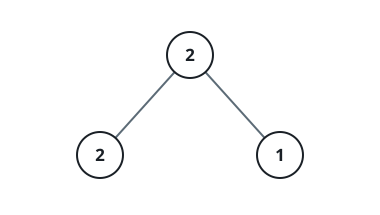

# Richest Repeat-Free Path

## Description

You are given the root of a binary tree; every node holds an integer value.

A walkable path here is any chain of adjacent nodes, and it qualifies as
repeat-free when:

- It may begin and end at whatever two nodes you like.
- It does not have to run through the root.
- No value appears twice along the chain.

Return the largest possible sum of node values over all repeat-free paths.

### Example 1



```text
Input: root = [2,2,1]
Output: 3
Explanation: The chain 2 -> 2 is off limits because the value 2 would
repeat. The richest repeat-free option is 2 -> 1, worth 2 + 1 = 3.
```

### Example 2


```text
Input: root = [1,-2,5,null,null,3,5]
Output: 9
Explanation: The chain 3 -> 5 -> 5 repeats a 5, so it cannot be taken.
The best legal chain is 1 -> 5 -> 3, worth 1 + 5 + 3 = 9.
```

### Example 3


```text
Input: root = [4,6,6,null,null,null,9]
Output: 19
Explanation: The full sweep 6 -> 4 -> 6 -> 9 crosses the value 6 twice, so
it is disqualified. Dropping one 6 leaves 4 -> 6 -> 9, worth 4 + 6 + 9 = 19.
```

### Constraints

- The number of nodes in the tree is in the range `[1, 1000]`.
- `-1000 <= Node.val <= 1000`

## Hints

### Hint 1

Let every node take a turn as the starting point of a path.

### Hint 2

Standing at a node, the walk may continue into the left child, the right
child, or back up to the parent.

### Hint 3

While searching, only step into a node whose value is not already on the
current path.

### Hint 4

The answer is the best sum seen across all starting points.
