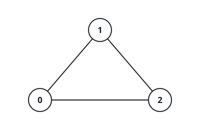
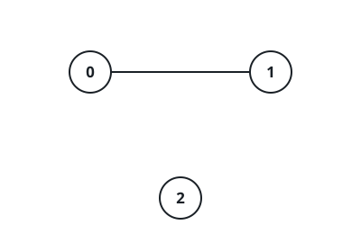

# Counting The Edges At Every Vertex

## Description

You are handed a square `matrix` of size `n x n` — the adjacency matrix of an
undirected graph whose vertices carry the labels `0` through `n - 1`. The
entries work as on/off flags for edges:

- `matrix[i][j] = 1` says an edge joins vertices `i` and `j`;
- `matrix[i][j] = 0` says no such edge exists.

A vertex's degree is how many edges touch it. Build an array `ans` of length
`n` in which `ans[i]` is the degree of vertex `i`, and return it.

### Example 1



```text
Input: matrix = [[0,1,1],[1,0,1],[1,1,0]]
Output: [2,2,2]
Explanation: Each of the three vertices touches the other two, so every
count comes out 2 and the answer is [2, 2, 2].
```

### Example 2



```text
Input: matrix = [[0,1,0],[1,0,0],[0,0,0]]
Output: [1,1,0]
Explanation: Vertices 0 and 1 share one edge, giving each a degree of 1,
while vertex 2 hangs alone with degree 0.
```

### Example 3

```text
Input: matrix = [[0,0,0,1],[0,0,0,0],[0,0,0,1],[1,0,1,0]]
Output: [1,0,1,2]
Explanation: Vertex 0 connects only to 3, vertex 1 connects to nothing,
vertex 2 connects only to 3, and vertex 3 connects to both 0 and 2 — so the
counts read [1, 0, 1, 2].
```

### Constraints

- `1 <= n == matrix.length == matrix[i].length <= 100`
- `matrix[i][i] == 0`
- `matrix[i][j]` is either `0` or `1`
- `matrix[i][j] == matrix[j][i]`

## Hints

### Hint 1

Because the matrix is symmetric with zero diagonals, a vertex's degree is
exactly the sum of its own row.
