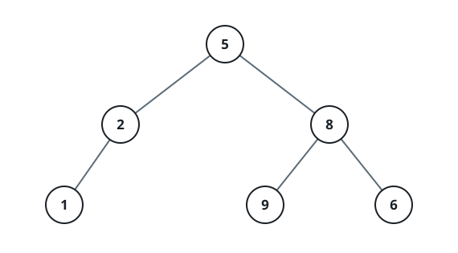
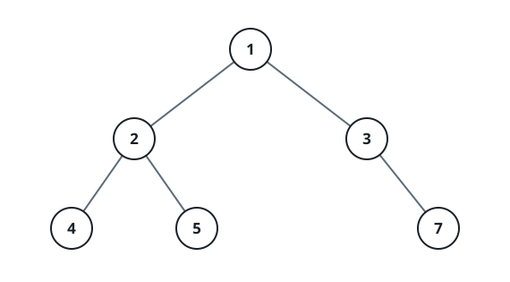

# Alternating Level Sums

## Description

You are given the `root` of a binary tree.

Walk the tree one level at a time, and let the sweep direction flip with
every level: odd-numbered levels (counting from one) sweep left to right,
even-numbered levels sweep right to left.

While sweeping a level in its direction, keep consuming nodes until just
before the first node that fails that level's requirement:

- On odd levels the requirement is a left child.
- On even levels the requirement is a right child.

A node without its requirement — and every node after it in that sweep —
contributes nothing to the level's sum.

Return an integer array `ans` where `ans[i]` holds the sum collected on
level `i + 1`.

### Example 1



```text
Input: root = [5,2,8,1,null,9,6]
Output: [5,8,0]
Explanation: Level 1 sweeps left to right: node 5 has a left child, so it
counts and ans[0] = 5.
Level 2 sweeps right to left: node 8 has a right child and counts, but node
2 has none, so the sweep halts there and ans[1] = 8.
Level 3 sweeps left to right: node 1 has no left child, so nothing counts
and ans[2] = 0.
Hence ans = [5, 8, 0].
```

### Example 2



```text
Input: root = [1,2,3,4,5,null,7]
Output: [1,5,0]
Explanation: Level 1 sweeps left to right: node 1 counts, so ans[0] = 1.
Level 2 sweeps right to left: nodes 3 and 2 each have a right child, so
both count and ans[1] = 3 + 2 = 5.
Level 3 sweeps left to right: node 4 has no left child, so nothing counts
and ans[2] = 0.
Hence ans = [1, 5, 0].
```

### Constraints

- The tree holds between `1` and `10⁵` nodes.
- `-10⁵ <= Node.val <= 10⁵`

## Hints

### Hint 1

A breadth-first sweep puts each complete level in your hand before it is
summed.

### Hint 2

Keep the current level's nodes in a list or queue; that frontier alone is
enough to build the next level.

### Hint 3

One boolean flips the sweep direction between levels, and each node must
pass the level's child check before its value joins the sum.
