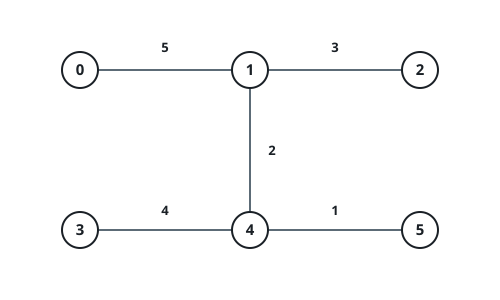
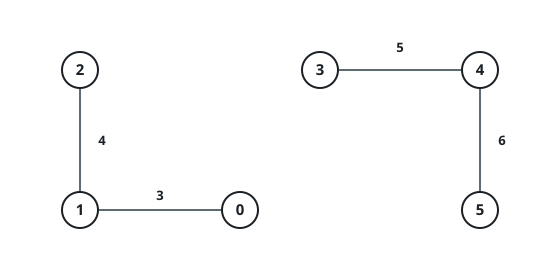
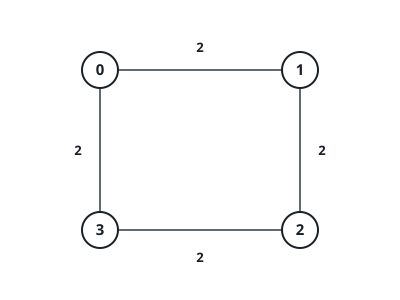

# The Lowest Threshold That Opens A Path

## Description

An undirected weighted graph has `n` nodes numbered `0` to `n - 1`. It is
given as a 2D integer array `edges`, where `edges[i] = [uᵢ, vᵢ, wᵢ]` joins
nodes `uᵢ` and `vᵢ` with weight `wᵢ`. You are also given a `source`, a
`target`, and an allowance `k`.

A threshold value splits the edges into two classes:

- an edge is _cheap_ when its weight is at most `threshold`;
- otherwise it is _costly_.

A route from `source` to `target` is acceptable when it travels along at
most `k` costly edges.

Return the smallest integer threshold for which some acceptable route
exists. When no threshold lets `target` be reached within the allowance,
return `-1`.



### Example 1

```text
Input: n = 6, edges = [[0,1,5],[1,2,3],[3,4,4],[4,5,1],[1,4,2]], source = 0, target = 3, k = 1
Output: 4
Explanation: At threshold 4 only the weight-5 edge 0-1 is costly, and the
route 0 → 1 → 4 → 3 crosses that one costly edge, exactly meeting the
allowance of 1. At threshold 3 both the weight-4 and weight-5 edges become
costly, and every route into node 3 must cross both, so 4 is minimal.
```

### Example 2



```text
Input: n = 6, edges = [[0,1,3],[1,2,4],[3,4,5],[4,5,6]], source = 0, target = 4, k = 1
Output: -1
Explanation: The edges split the graph into two disconnected pieces, {0, 1,
2} and {3, 4, 5}, so node 4 is unreachable no matter what the threshold is.
```

### Example 3



```text
Input: n = 4, edges = [[0,1,2],[1,2,2],[2,3,2],[3,0,2]], source = 0, target = 0, k = 0
Output: 0
Explanation: The route starts and ends at the same node, crossing no edges
at all, so even the smallest possible threshold 0 already works.
```

### Example 4

```text
Input: n = 5, edges = [[0,1,4],[1,2,9],[2,3,3],[3,4,8],[0,2,6]], source = 0, target = 4, k = 1
Output: 6
Explanation: At threshold 6 only the weight-8 edge is costly, and the route
0 → 2 → 3 → 4 crosses it exactly once. At threshold 5 both the weight-6 and
weight-8 edges are costly, and every route into node 4 crosses both, so the
allowance of 1 fails.
```

### Constraints

- `1 <= n <= 10³`
- `0 <= edges.length <= 10³`
- `edges[i] = [uᵢ, vᵢ, wᵢ]`
- `0 <= uᵢ, vᵢ <= n - 1`
- `1 <= wᵢ <= 10⁹`
- `0 <= source, target <= n - 1`
- `0 <= k <= edges.length`
