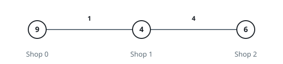

# The Apple Errand II

## Description

You are given an integer `n` and an integer array `prices` of length `n`,
where `prices[i]` is what shop `i` charges for apples.

You are also given a 2D integer array `roads`, where
`roads[i] = [uᵢ, vᵢ, costᵢ, taxᵢ]` describes one bidirectional road:

- `uᵢ` and `vᵢ` are the two shops the road links.
- `costᵢ` is what it costs to walk the road with empty hands.
- `taxᵢ` is the multiplier applied to `costᵢ` while walking it with apples
  in hand.

Standing at shop `i`, you have two ways to end up with apples:

- Buy them right there for `prices[i]`.
- Or pick some shop `j`, travel there over any number of roads while still
  empty-handed, buy apples for `prices[j]`, and carry them back to shop `i`,
  paying `cost * tax` for every road of the return leg.

The outbound trip and the return trip need not use the same roads.

Build the integer array `ans` of length `n` so that `ans[i]` is the least
money that gets you apples when you start from shop `i`.

### Example 1


```text
Input: n = 2, prices = [8,3], roads = [[0,1,1,2]]
Output: [6,3]
```

### Example 2



```text
Input: n = 3, prices = [9,4,6], roads = [[0,1,1,3],[1,2,4,2]]
Output: [8,4,6]
```

### Example 3


```text
Input: n = 3, prices = [10,11,1], roads = [[0,2,1,3],[1,2,3,4],[0,1,5,2]]
Output: [5,11,1]
```

### Constraints

- `1 <= n <= 1000`
- `prices.length == n`
- `1 <= prices[i] <= 10⁹`
- `0 <= roads.length <= min(n * (n - 1) / 2, 2000)`
- `roads[i] = [uᵢ, vᵢ, costᵢ, taxᵢ]`
- `0 <= uᵢ, vᵢ <= n - 1`
- `uᵢ != vᵢ`
- `1 <= costᵢ <= 10⁹`
- `1 <= taxᵢ <= 100`
- No two roads connect the same pair of shops.

### Hint 1

For a fixed start `i` and purchase shop `j`, the empty outbound walk and the
loaded return walk never influence each other, so their cheapest costs can be
found separately and simply added.

### Hint 2

Run two distance searches per starting shop — one weighting every road by
`cost`, the other by `cost * tax` — then take the smallest `prices[j]` plus
the two distances over all shops `j` the searches can both reach.
