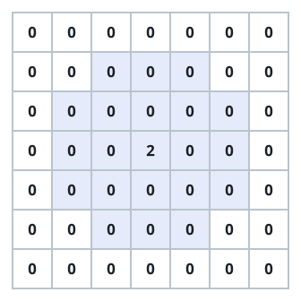

# Max Pooling II

## Description

You are handed an `n x m` matrix `grid` of non-negative integers.

This time the pooling question is reversed: instead of collapsing blocks,
you count the cells that can call themselves the tallest in sight. Every
non-zero cell `(row, col)` looks around itself as follows:

- Let `x = grid[row][col]`.
- Its reach is every cell lying within `x` rows and `x` columns of
  `(row, col)`.
- Cells that fall outside the matrix are out of reach.
- The four cells whose row distance and column distance are both exactly
  `x` are ignored.

The cell `(row, col)` is a local maximum when it is non-zero and no cell
in its reach holds a value greater than `x`.

Return how many local maximums `grid` contains.

### Example 1



```text
Input: grid = [[0,0,0,0,0,0,0],[0,0,0,0,0,0,0],[0,0,0,0,0,0,0],[0,0,0,2,0,0,0],[0,0,0,0,0,0,0],[0,0,0,0,0,0,0],[0,0,0,0,0,0,0]]
Output: 1
Explanation: The figure highlights the reach of the lone non-zero cell
(3, 3), whose value x = 2 spans two rows and two columns in every
direction. The four cells sitting exactly two rows and two columns away
are skipped, nothing in reach exceeds 2, so the cell counts.
```

### Example 2

```text
Input: grid = [[4,9],[8,1]]
Output: 1
Explanation: The 9 towers over the whole matrix. Every other non-zero
cell reaches it (or another strictly greater value), so only the 9 is a
local maximum.
```

### Example 3

```text
Input: grid = [[6,6],[6,6],[6,6]]
Output: 6
Explanation: Every cell holds the same value 6, so no cell ever sees a
greater value in its reach and all six cells qualify.
```

### Example 4

```text
Input: grid = [[2,0,0],[0,1,0],[0,0,0]]
Output: 2
Explanation: The cell holding 1 reaches one row and one column, and the
four diagonal corners of that square — including the 2 — are excluded, so
1 survives. The 2 itself reaches the whole matrix except the far corner
(2, 2) and finds nothing greater, so it counts too.
```

### Constraints

- `1 <= n == grid.length <= 200`
- `1 <= m == grid[i].length <= 200`
- `0 <= grid[i][j] <= 200`

### Hint 1

Scanning each cell's square directly can cost a full `200 x 200` sweep per
cell — hopeless when many cells carry large values.

### Hint 2

Values never pass 200, so for each threshold `v` build a two-dimensional
prefix sum that counts the cells strictly greater than `v`.

### Hint 3

A cell with value `x` then fires one clamped-square query against the
threshold-`x` prefix sum; it is a local maximum exactly when the count is
zero after removing the four ignored corners.
