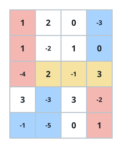
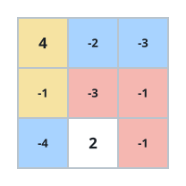

# Heaviest Overlap of Two Walks

## Description

You are given an `m x n` matrix `grid` of integers, which may be
negative.

Two walkers set out across it. The first starts at the top-left cell
`(0, 0)` and finishes at the bottom-right cell `(m - 1, n - 1)`,
moving only right or down. The second starts at the bottom-left cell
`(m - 1, 0)` and finishes at the top-right cell `(0, n - 1)`, moving
only right or up. Each walker picks any single route its steps allow.

A cell is shared when both chosen routes pass through it.

Return the greatest possible sum of the values of all shared cells.

### Example 1



```text
Input: grid = [[1,2,0,-3],[1,-2,1,0],[-4,2,-1,3],[3,-3,3,-2],[-1,-5,0,1]]
Output: 4
Explanation: The first route runs down the left edge, cuts across the
third row, and leaves down the right edge. The second walks along the
bottom row, turns up into that same third row, and follows it to the
top-right corner. The highlighted cells 2, -1, 3 are covered by both
routes and sum to 4, and no pair of routes can share a heavier set.
```

### Example 2



```text
Input: grid = [[4,-2,-3],[-1,-3,-1],[-4,2,-1]]
Output: 3
Explanation: One pairing sends the first walker down the left column
and then along the middle row, while the second climbs the left column
and finishes along the top row. The two routes overlap on the 4 and the
-1, worth 3 in total, and nothing heavier is achievable.
```

### Constraints

- `m == grid.length`
- `n == grid[i].length`
- `2 <= m, n <= 1000`
- `4 <= m * n <= 5 * 10⁵`
- `-100 <= grid[i][j] <= 100`

### Hint 1

Whenever the routes meet, they meet in a run: the shared cells always
form one contiguous stretch lying inside a single row or a single
column.

### Hint 2

A lone shared cell can never touch the border — each walker needs room
to arrive and to leave, so only interior cells qualify on their own.

### Hint 3

Scan every row and every column for the best contiguous run of length
at least two, then compare those winners against the best interior
single cell.
