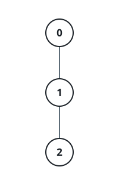
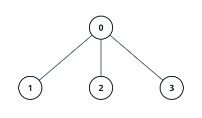

# Independent Subsets On A Family Tree

## Description

A rooted tree has `n` nodes numbered `0` through `n - 1` and reaches you
as an array `parent` of length `n`:

- `parent[0] = -1`, marking node `0` as the root.
- Every other node obeys `0 <= parent[i] < i`, so a parent always carries
  a smaller label than its child.

Alongside it you receive an array `nums` of length `n`, where `nums[i]` is
the value written on node `i`, and an integer `k`.

Call a set of nodes an independent subset when it is non-empty and:

- no chosen node sits next to another chosen node — a node and its
  direct parent may never both appear;
- the values of the chosen nodes add up to a multiple of `k`.

Count the independent subsets modulo `10⁹ + 7`.

### Example 1



```text
Input: parent = [-1,0,1], nums = [1,2,3], k = 3
Output: 1
Explanation: The three nodes hang in a chain. Taking node 2 alone
collects the value 3, a multiple of 3, while every other non-empty pick
either pairs a parent with its child or totals a number that misses a
multiple of 3.
```

### Example 2



```text
Input: parent = [-1,0,0,0], nums = [2,1,2,1], k = 3
Output: 2
Explanation: The root's three children are mutual strangers — no two of
them are attached to each other. Choosing children 1 and 2 sums to
1 + 2 = 3, and choosing children 2 and 3 sums to 2 + 1 = 3. Each child
alone falls short of a multiple of 3, and bringing the root along breaks
the distance rule, so two subsets qualify.
```

### Constraints

- `n == parent.length == nums.length`
- `1 <= n <= 1000`
- `parent[0] == -1`
- `0 <= parent[i] < i` for every `1 <= i < n`
- `1 <= nums[i] <= 10⁹`
- `1 <= k <= 100`
- `parent` always describes a genuine rooted tree.

### Hint 1

Work bottom-up. Give every node two tables indexed by residue mod `k`:
one counting subtree picks that leave the node out, one counting those
that take it.

### Hint 2

A node left out begins with exactly one pick — the empty one, at residue
0; a node taken begins with its own singleton at `nums[node] % k`. Folding
a child in is a convolution over residues, but into the taken table only
the child's left-out rows may flow.

### Hint 3

The answer is both root tables read at residue 0, minus one for the
all-empty pick.
