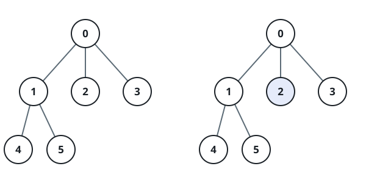
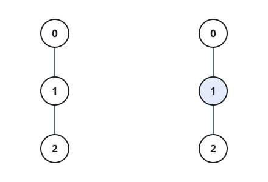
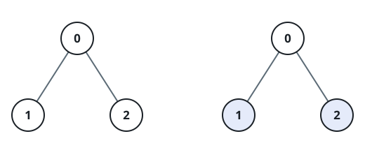
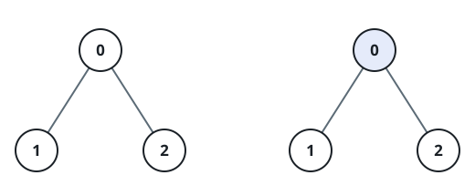

# Subtree Flips At A Distance II

## Description

A tree is given with its root at node 0, and every node holds a value.

A flip picks one node and negates every value in that node's rooted
subtree — each of them is multiplied by `-1`. Flips constrain one another
through distance only: any two flipped nodes must lie at least `k` edges
apart in the tree.

Pick any set of flips obeying that rule and return the greatest possible
sum of all node values afterwards.

### Example 1



```text
Input: edges = [[0,1],[0,2],[0,3],[1,4],[1,5]], nums = [1,0,-10,3,4,5], k = 2
Output: 23
```

### Example 2



```text
Input: edges = [[0,1],[1,2]], nums = [5,-10,-10], k = 1
Output: 25
```

### Example 3



```text
Input: edges = [[0,1],[0,2]], nums = [1,-5,-6], k = 2
Output: 12
```

### Example 4



```text
Input: edges = [[0,1],[0,2]], nums = [1,-5,-6], k = 3
Output: 10
```

### Constraints

- `2 <= nums.length <= 5 * 10⁴`
- `edges.length == nums.length - 1`
- `-4 * 10⁴ <= nums[i] <= 4 * 10⁴`
- `1 <= k <= 50`
- `edges` forms a tree.

### Hint 1

For every subtree, remember how far away its nearest flip is, with
distances capped at `k`.

### Hint 2

Nearest-flip distances `a` and `b` from two different child subtrees get
along exactly when `a + b >= k`.

### Hint 3

Negation swaps a subtree's best and worst arrangements, so every state
needs a minimum stored beside its maximum.
