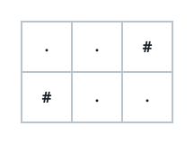
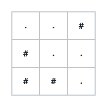

# One Clear Route Across The Grid

## Description

Two integers `m` and `n` give the number of rows and columns of a grid you
are going to draw.

Build any `m x n` grid whose cells hold one of two characters:

- `.` marks an open cell.
- `#` marks a walled-off cell.

A route is a sequence of open cells that:

- Begins at the top-left cell `(0, 0)`.
- Finishes at the bottom-right cell `(m - 1, n - 1)`.
- Only ever steps:
    - Right, from `(i, j)` to `(i, j + 1)`, or
    - Down, from `(i, j)` to `(i + 1, j)`.

Return any grid in which exactly one such route exists.

### Example 1

```text
Input: m = 2, n = 3
Output: ["..#","#.."]
Explanation:
    The open cells bend into a single corridor — along the top row to
    (0,1), then down to (1,1) and right to (1,2). The wall at (0,2) cuts
    off the only possible branch, so the walk (0,0) → (0,1) → (1,1) →
    (1,2) is the one route that survives.
```



### Example 2

```text
Input: m = 3, n = 3
Output: ["..#","#..","##."]
Explanation:
    The same staircase gains a third rung: the walk runs (0,0) → (0,1) →
    (1,1) → (1,2) → (2,2), and every cell that could start a detour is
    walled off.
```



### Example 3

```text
Input: m = 5, n = 4
Output: ["....","###.","###.","###.","###."]
Explanation:
    An L made of open cells works too: run along the whole top row, then
    down the last column. A right/down walk can never leave that L, and
    it can never skip a cell of it either.
```

### Constraints

- `1 <= m, n <= 25`

### Hint 1

Leave one corridor of open cells standing and wall off everything else.

### Hint 2

Many corridor shapes qualify. What is the cheapest one to write down?

### Hint 3

One answer: sweep right across the first row, then straight down the last
column, filling the rest of the grid with walls.
