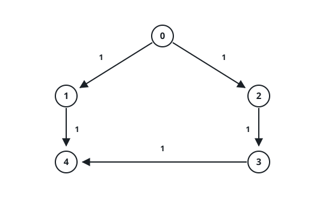
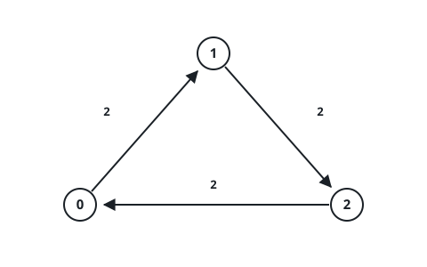
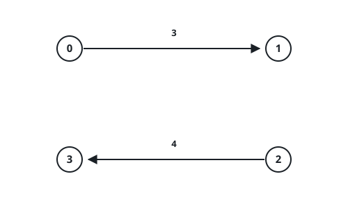

# The Rationed Signal Relay

## Description

A signal has to travel across a directed weighted graph with `n` nodes
numbered `0` through `n - 1`.

The graph arrives as a 2D integer array `edges`, where
`edges[i] = [ui, vi, ti]` is a one-way link from `ui` to `vi` whose
traversal costs `ti` seconds.

Two more inputs ration the trip. An integer `power` is the signal's full
fuel tank at launch, and an array `cost` of length `n` prices each node:
`cost[u]` is the fuel spent whenever the signal is re-emitted from `u`
along some outgoing link.

The journey starts at `source` at time 0 with all `power` units on board
and obeys these rules:

- Leaving a node `u` is only allowed while the tank still holds at least
  `cost[u]` units.
- Simply arriving somewhere burns nothing; fuel leaves the tank only when
  the signal departs a node.
- Each departure from `u` drains exactly `cost[u]` units.
- Crossing `edges[i] = [ui, vi, ti]` adds `ti` seconds to the clock.

Return an integer array `answer` of size 2:

- `answer[0]` is the fewest seconds in which `target` can be reached.
- `answer[1]` is the largest fuel leftover over all routes that manage
  that fewest-second arrival.

When `target` is out of reach, return `[-1, -1]`.

### Example 1



```text
Input: n = 5, edges = [[0,1,1],[1,4,1],[0,2,1],[2,3,1],[3,4,1]], power = 4, cost = [2,3,1,1,1], source = 0, target = 4

Output: [3,0]

Explanation:

    The signal leaves node 0 carrying 4 units.
    The shortcut 0 -> 1 -> 4 is a dead end: departing node 0 costs 2,
    which leaves only 2 units, below the 3 needed to depart node 1.
    The workable route 0 -> 2 -> 3 -> 4 spends 1 + 1 + 1 = 3 seconds.
    Its departures burn cost[0] + cost[2] + cost[3] = 2 + 1 + 1 = 4
    units, draining the tank to exactly 0.
    The answer is [3, 0].
```

### Example 2



```text
Input: n = 3, edges = [[0,1,2],[1,2,2],[2,0,2]], power = 3, cost = [1,1,1], source = 1, target = 1

Output: [0,3]

Explanation:

    Source and target coincide, so nothing needs to move.
    The clock stays at 0 and the tank stays full, giving [0, 3].
```

### Example 3



```text
Input: n = 4, edges = [[0,1,3],[2,3,4]], power = 3, cost = [1,1,1,1], source = 0, target = 3

Output: [-1,-1]

Explanation:

The two links never connect node 0's side to node 3's side, so node 3
cannot be reached and the answer is [-1, -1].
```

### Constraints

- `1 <= n <= 1000`
- `0 <= edges.length <= 1000`
- `edges[i] = [uᵢ, vᵢ, tᵢ]`
- `0 <= uᵢ, vᵢ <= n - 1`
- `1 <= tᵢ <= 10⁹`
- `1 <= power <= 1000`
- `cost.length == n`
- `1 <= cost[i] <= 2000`
- `0 <= source, target <= n - 1`

## Hints

### Hint 1

A node alone is not a fine enough state — how much fuel is left changes
what is reachable next.

### Hint 2

Run Dijkstra over pairs `(node, remainingPower)`.

### Hint 3

Departing a state `(u, p)` is legal only while `p >= cost[u]`, and every
outgoing link lands in a state with `p - cost[u]` fuel.

### Hint 4

Once times are settled, look only at target states holding the smallest
time and take the greatest fuel among them.
