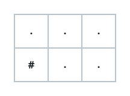
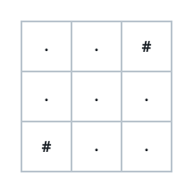

# Fitting A Grid To K Routes I

## Description

You are handed three integers `m`, `n`, and `k`, and asked to draw an
`m x n` grid out of just two characters: `.` marks an open cell, `#` marks
a wall.

A route across the grid:

- begins at the top-left cell `(0, 0)`,
- ends at the bottom-right cell `(m - 1, n - 1)`,
- steps only right, `(i, j)` to `(i, j + 1)`, or down, `(i, j)` to
  `(i + 1, j)`,
- and never enters a wall cell.

Draw any grid holding exactly `k` such routes from corner to corner. If no
arrangement can manage it, return an empty array.

### Example 1

```text
Input: m = 2, n = 3, k = 2
Output: ["...","#.."]
Explanation: Exactly two routes run from (0, 0) to (1, 2): ride the top row
and drop down at the end, or drop down at the middle column:
(0, 0) → (0, 1) → (0, 2) → (1, 2)
(0, 0) → (0, 1) → (1, 1) → (1, 2)
```



### Example 2

```text
Input: m = 3, n = 3, k = 4
Output: ["..#","...","#.."]
Explanation: The four routes from (0, 0) to (2, 2) all pass through the
center cell (1, 1), which can be entered from two sides and left toward two
sides:
(0, 0) → (0, 1) → (1, 1) → (1, 2) → (2, 2)
(0, 0) → (0, 1) → (1, 1) → (2, 1) → (2, 2)
(0, 0) → (1, 0) → (1, 1) → (1, 2) → (2, 2)
(0, 0) → (1, 0) → (1, 1) → (2, 1) → (2, 2)
```



### Example 3

```text
Input: m = 4, n = 1, k = 1
Output: [".",".",".","."]
Explanation: A lone column can be walked from end to end in exactly one
way, which is precisely what k = 1 asks for.
```

### Constraints

- `1 <= m, n <= 10`
- `1 <= k <= 4`

## Hints

### Hint 1

A board that is only one row or one column tall offers a single route and
nothing else, so any `k` above 1 is hopeless there.

### Hint 2

For boards at least `2 x 2`, a tiny fixed block per value of `k` is enough
to cover every case from 1 to 4.

### Hint 3

An open `2 x 2` block carries exactly two routes: right then down, or down
then right.

### Hint 4

An open `2 x 3` block — or its `3 x 2` transpose — carries exactly three
routes.

### Hint 5

For four routes, use a fully open `2 x 4` or `4 x 2` block, or a `3 x 3`
block whose top-right and bottom-left cells are walled.

### Hint 6

Place the block in a corner, join its bottom-right cell to `(m - 1, n - 1)`
with a one-cell-wide corridor, and wall off everything else. If the block
cannot fit in either orientation, no grid exists — return an empty array.
