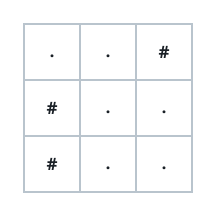
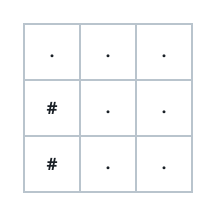

# Fitting A Grid To K Routes II

## Description

You are given an integer `k`.

Draw a grid out of just two characters — `.` marks an open cell, `#` marks a
wall — carrying at most 25 rows and at most 25 columns.

A route across your grid:

- begins at the top-left cell `(0, 0)`,
- ends at the bottom-right cell `(m - 1, n - 1)` of your `m x n` drawing,
- steps only right, `(i, j)` to `(i, j + 1)`, or down, `(i, j)` to
  `(i + 1, j)`,
- and never enters a wall cell.

Draw any grid holding exactly `k` such routes from corner to corner. If no
grid within the size bound can manage it, return an empty array.

### Example 1

```text
Input: k = 2
Output: ["..#","#..","#.."]
Explanation: The two routes part ways after the opening step and reunite at
the bottom-right:
(0, 0) → (0, 1) → (1, 1) → (1, 2) → (2, 2)
(0, 0) → (0, 1) → (1, 1) → (2, 1) → (2, 2)
```



### Example 2

```text
Input: k = 3
Output: ["...","#..","#.."]
Explanation: Three routes run from (0, 0) to (2, 2) — the top row feeds all
of them before they fan out:
(0, 0) → (0, 1) → (0, 2) → (1, 2) → (2, 2)
(0, 0) → (0, 1) → (1, 1) → (1, 2) → (2, 2)
(0, 0) → (0, 1) → (1, 1) → (2, 1) → (2, 2)
```



### Example 3

```text
Input: k = 1
Output: ["."]
Explanation: A single open cell serves as both corners at once, and there is
exactly one way to stand on it.
```

### Constraints

- `1 <= k <= 1000`

## Hints

### Hint 1

An open `2 x 2` block carries exactly two routes from its own top-left corner
to its own bottom-right corner.

### Hint 2

String such blocks together and each one doubles the number of ways the walk
can arrive at the next stage.

### Hint 3

That lets you manufacture cells reachable in exactly 1, 2, 4, 8, ... routes.

### Hint 4

Split `k` into powers of two and give every power in the split its own
branch off the doubling chain.

### Hint 5

Merge every branch into a single final corridor whose own corner-to-corner
walk is unique, so the branch counts add up untouched.

### Hint 6

`k <= 1000` needs no more than ten powers of two, and the whole construction
stays far inside the `25 x 25` bound.

### Hint 7

Sizing check: with highest power `2^e`, a doubling chain plus one collector
column fits in `(2e + 1)` rows and `(2e + 4)` columns — at most 19 by 22 for
this constraint.
