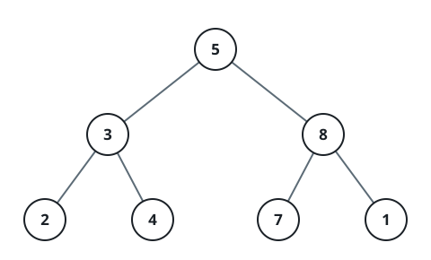
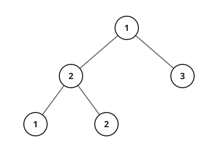

# Counting The Subtree Champions

## Description

You are given the root of a complete binary tree.

Call a node a champion when its value ties the largest value anywhere in
the subtree it heads — the node itself counts as part of that subtree.

Count the champions in the tree.

### Example 1



```text
Input: root = [5,3,8,2,4,7,1]
Output: 5
Explanation:
    Every leaf champions its own subtree: the 2, the 4, the 7, and the 1.
    The 8 also qualifies, since it tops its subtree [8, 7, 1]. The root's
    5 loses to the 8, and the 3 loses to its own leaf 4 — five champions
    in total.
```

### Example 2



```text
Input: root = [1,2,3,1,2]
Output: 4
Explanation:
    The three leaves 1, 2, and 3 each lead their own subtree, and the 2
    heading [2, 1, 2] equals its subtree's largest value. Only the root's
    1 falls short against the 2 and 3 below it, leaving four champions.
```

### Example 3

```text
Input: root = [2,9,2,1]
Output: 3
Explanation:
    The leaves 1 and 2 champion themselves, the 9 tops its subtree
    [9, 1], but the root's 2 is dwarfed by the 9 — three champions.
```

### Constraints

- The tree holds between `1` and `10^5` nodes.
- `1 <= Node.val <= 10^9`
- The tree is guaranteed to be complete.

## Hints

### Hint 1

Walk the tree postorder, so each node is visited only after both of its
subtrees have been settled.

### Hint 2

Fold the two child reports into the node's own value to learn the largest
value under it.

### Hint 3

Whenever that subtree maximum equals the node's value, the node is a
champion — tally it and pass the maximum upward.
