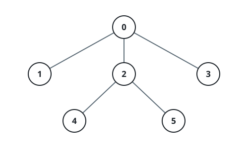
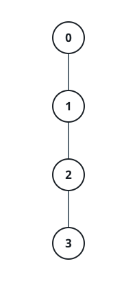

# Depth-Weighted Tree Total

## Description

You are given an integer array `parent` of length `n` describing a tree
rooted at node `0` and labeled `0` through `n - 1`: `parent[0] = -1`, and
`parent[i]` names node `i`'s parent for every `1 <= i <= n - 1`.

You are also given an integer array `nums` of length `n`, where `nums[i]`
is the value stored at node `i`.

Define the **depth** of a node as the number of nodes on the path from the
root down to it, counting the node itself — the root has depth `1` — and
the **height** `h` of the tree as the largest depth reached by any node.

Every node `i` sitting at depth `d` contributes a weight of
`nums[i] * (h - d + 1)` — nodes closer to the root weigh more, and the
deepest nodes weigh exactly `nums[i]`.

Return the sum of every node's weight.

### Example 1



```text
Input: parent = [-1,0,0,0,2,2], nums = [5,2,3,1,4,6]
Output: 37
Explanation: This tree has height 3.

Node   nums[i]   Depth (d)   Weight
0      5         1           5 * (3 - 1 + 1) = 15
1      2         2           2 * (3 - 2 + 1) = 4
2      3         2           3 * (3 - 2 + 1) = 6
3      1         2           1 * (3 - 2 + 1) = 2
4      4         3           4 * (3 - 3 + 1) = 4
5      6         3           6 * (3 - 3 + 1) = 6

Summing every row gives 15 + 4 + 6 + 2 + 4 + 6 = 37.
```

### Example 2



```text
Input: parent = [-1,0,1,2], nums = [1,2,3,4]
Output: 20
Explanation: This tree is a single chain, so its height is 4.

Node   nums[i]   Depth (d)   Weight
0      1         1           1 * (4 - 1 + 1) = 4
1      2         2           2 * (4 - 2 + 1) = 6
2      3         3           3 * (4 - 3 + 1) = 6
3      4         4           4 * (4 - 4 + 1) = 4

Summing every row gives 4 + 6 + 6 + 4 = 20.
```

### Constraints

- `1 <= n <= 10⁵`
- `n == parent.length == nums.length`
- `parent[0] == -1`
- `0 <= parent[i] <= n - 1` for all `i` in `[1, n - 1]`
- `1 <= nums[i] <= 10⁶`
- The input is generated such that `parent` represents a valid tree rooted
  at node 0.

## Hints

### Hint 1

Build the tree from the parent links and traverse it from the root to find
every node's depth and the tree's overall height `h`.

### Hint 2

With `h` known, sum `nums[i] * (h - depth[i] + 1)` across every node `i`.
