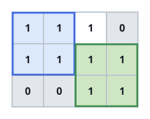

# Largest Pair of Disjoint Square Blocks

## Description

You are given a 2D integer matrix `mat` of size `m × n`, where `mat[r][c]`
is `1` when the cell at row `r`, column `c` is usable and `0` when it is
not.

Find two square blocks of the same side length `k` such that:

- Neither block shares a cell with the other.
- Every cell each block covers is usable.

Return the area of each square in the best such pair — both squares are
equal, so their areas match — or `0` if no such pair exists.

### Example 1



```text
Input: mat = [[1,1,1,0],[1,1,1,1],[0,0,1,1]]
Output: 4
Explanation: The widest matching pair uses side length k = 2, giving area
4. One square anchors at (0, 0), covering (0,0), (0,1), (1,0), and (1,1);
the other anchors at (1, 2), covering (1,2), (1,3), (2,2), and (2,3) — the
two share no cell.
```

### Example 2


```text
Input: mat = [[0,1],[1,0]]
Output: 1
Explanation: The two usable cells sit diagonally apart, so the widest
matching pair is side length k = 1: one square at (0, 1) and the other at
(1, 0), giving area 1.
```

### Example 3


```text
Input: mat = [[0,0],[0,1]]
Output: 0
Explanation: Only one cell is usable, which is not enough to place two
disjoint squares of any size, so the answer is 0.
```

### Constraints

- `mat.length == m`
- `mat[i].length == n`
- `1 <= m, n <= 500`
- `mat[i][j]` is either `0` or `1`.

## Hints

### Hint 1

Binary search the largest side length `k`: whenever two disjoint squares
of side `k` exist, two disjoint squares of every smaller side also exist.

### Hint 2

A 2D prefix sum lets you test in constant time whether every cell inside a
candidate square is usable.

### Hint 3

For a fixed `k`, track the minimum and maximum row and column among every
valid square's top-left corner. Two squares can avoid overlapping exactly
when that row spread or that column spread reaches at least `k`.
