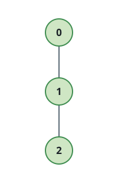
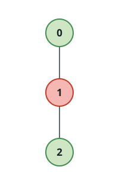

# Group Distance Totals on a Tree II

## Description

You are given an integer `n` and an undirected tree with `n` nodes labeled
`0` through `n - 1`, rooted at node `0`. The tree is given as a 2D integer
array `edges` of length `n - 1`, where `edges[i] = [ui, vi]` connects nodes
`ui` and `vi`.

You are also given an integer array `group` of length `n`: node `i` belongs
to group `group[i]`, and two nodes are groupmates exactly when their group
labels match.

For a pair of groupmates, define their interaction cost as the number of
edges on the unique path connecting them in the tree.

Return the sum of interaction costs across every pair of indices `(u, v)`
with `0 <= u < v < n` where `u` and `v` are groupmates.

### Example 1



```text
Input: n = 3, edges = [[0,1],[1,2]], group = [1,1,1]
Output: 4
Explanation: Every node shares group 1, so all three pairs count: nodes 0
and 1 sit one edge apart, nodes 1 and 2 sit one edge apart, and nodes 0
and 2 sit two edges apart. The total is 1 + 1 + 2 = 4.
```

### Example 2



```text
Input: n = 3, edges = [[0,1],[1,2]], group = [3,2,3]
Output: 2
Explanation: Only nodes 0 and 2 share a group, sitting two edges apart.
Node 1 is alone in its group and forms no pair. The total is 2.
```

### Example 3


```text
Input: n = 4, edges = [[0,1],[0,2],[0,3]], group = [1,1,4,4]
Output: 3
Explanation: Nodes 0 and 1 share group 1, one edge apart; nodes 2 and 3
share group 4, two edges apart (through node 0). The total is 1 + 2 = 3.
```

### Example 4

```text
Input: n = 2, edges = [[0,1]], group = [1,2]
Output: 0
Explanation: The two nodes belong to different groups, so no pair counts,
and the total is 0.
```

### Constraints

- `1 <= n <= 10⁵`
- `edges.length == n - 1`
- `edges[i] = [ui, vi]`
- `0 <= ui, vi <= n - 1`
- `group.length == n`
- `1 <= group[i] <= n`
- The input is generated such that `edges` represents a valid tree.

## Hints

### Hint 1

(Virtual Tree) Removing any single edge splits the tree into two pieces.
If one piece holds `x` nodes of some group and the whole tree holds `k`
nodes of that group, that edge contributes `x * (k - x)` to the total.

### Hint 2

(Virtual Tree) Precompute depths, DFS entry times, and lowest common
ancestors. For each group, sort its member nodes by entry time and build
their virtual tree by inserting the LCA of every adjacent pair.

### Hint 3

(Virtual Tree) A virtual-tree edge from `p` to `v` has length `depth[v] -
depth[p]`. If the virtual subtree below it holds `x` nodes of the group,
its contribution is `x * (k - x) * (depth[v] - depth[p])`.

### Hint 4

(Small-to-Large Merging) At each subtree, track per group both the node
count and the sum of distances from those nodes up to the subtree's root.

### Hint 5

(Small-to-Large Merging) Merging two subtrees' maps at a shared node
combines matching group entries `(cnt1, sum1)` and `(cnt2, sum2)` into a
contribution of `cnt1 * sum2 + cnt2 * sum1`; always fold the smaller map
into the larger one.
