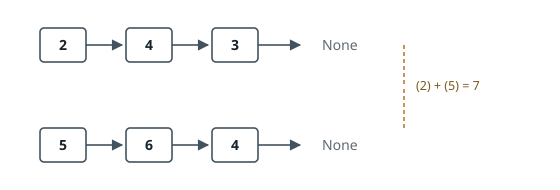

# Add Two Numbers

## Description

You are given two non-empty linked lists representing two non-negative
integers. The digits are stored in reverse order, and each of their nodes
contains a single digit. Add the two numbers and return the sum as a linked
list.

You may assume the two numbers do not contain any leading zero, except the
number `0` itself.

### Example 1

```text
Input: l1 = [2,4,3], l2 = [5,6,4]
Output: [7,0,8]
Explanation: 342 + 465 = 807.
```



### Example 2

```text
Input: l1 = [0], l2 = [0]
Output: [0]
```

### Example 3

```text
Input: l1 = [9,9,9,9,9,9,9], l2 = [9,9,9,9]
Output: [8,9,9,9,0,0,0,1]
```

### Constraints

- The number of nodes in each linked list is in the range `[1, 100]`.
- `0 <= Node.val <= 9`
- It is guaranteed that the list represents a number that does not have
  leading zeros.

## Hints

### Hint 1

Track the carry as you walk both lists node by node, exactly like digit-by-digit addition on paper.

### Hint 2

The two lists may have different lengths; once one runs out, keep processing the longer one with the remaining carry.

### Hint 3

A final carry of 1 after both lists end still appends one more node.
