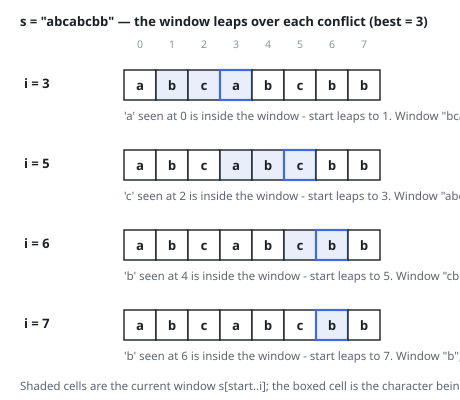

# Solutions — Longest Substring Without Repeating Characters

Two sliding windows with different eviction disciplines. Both keep the
invariant that the current window `s[start..i]` never contains a
duplicate character; they differ in how `start` retreats when a
duplicate would arrive — one shrinks a step at a time, the other leaps
straight over the conflict.

## sliding

Maintain the invariant that the window `s[start..i]` never contains a duplicate character, and keep a set holding exactly the characters inside it. When the character `c` arriving at index `i` is already in the set, the window must lose its older copy of `c` before the new one can enter — so the window shrinks from the left one character at a time, removing `s[start]` from the set and advancing `start`, until `c` is no longer present. Then `c` joins the set and the window is duplicate-free again; the best length is updated as `i - start + 1`.

The eviction loop is what makes this correct: it removes exactly the characters that can no longer belong to any duplicate-free window ending at `i`, and it stops the instant `c` is gone, keeping the window as large as the invariant allows. Because `start` only ever moves right and can never pass `i`, each character enters the set once and leaves at most once — the whole eviction work across the scan is bounded by `n` removals, so the nested loop is amortized linear rather than quadratic.

Edge cases fall out of the loop structure: an empty string never enters the loop and returns 0, and a string of one repeated character (`"bbbbb"`) keeps the window pinned at size 1 — each new `b` immediately evicts the previous one. The set holds at most one entry per distinct character `k`, and the input alphabet is tiny, so the extra memory is negligible next to the input.

**Complexity:** `O(n)` time (amortized — each character is added and evicted at most once), `O(k)` space for the window set.

## last_index_jump

Same invariant, lazier bookkeeping. Instead of a set that must be maintained removal by removal, remember in `last_seen` the most recent index of every character encountered. When the character `c` arriving at index `i` already appears inside the current window, the window can no longer include that older occurrence, so `start` jumps directly to `last_seen[c] + 1`. This is a sliding window that never shrinks one position at a time — it leaps over the conflict.

The guard `last_seen[c] >= start` is the subtle part: it ensures an occurrence that lies to the left of the window is simply ignored. Without it, `start` could be dragged backwards and the window would incorrectly lose characters that are no longer inside it. Because `start` only ever moves right, each character enters and leaves consideration in a single forward sweep, and after processing index `i` the window is again duplicate-free; the best length is updated as `i - start + 1`.

Edge cases fall out the same way: an empty string never enters the loop and returns 0, and a string of one repeated character keeps the window pinned at size 1. The `last_seen` map holds at most one entry per distinct character `k`, and the input alphabet is tiny, so the extra memory is negligible next to the input. The win over the set-based window is doing O(1) work per duplicate rather than re-walking every evicted position — at the cost of having to keep the stale-entry guard.

**Complexity:** `O(n)` time, `O(k)` space (where `k` is the number of distinct characters).
