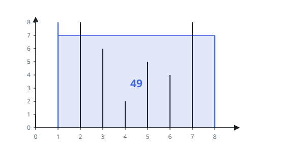
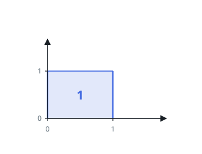

# Container With Most Water

## Description

You are given an integer array `height` of length `n`. There are `n` vertical
lines drawn such that the two endpoints of the `ith` line are `(i, 0)` and
`(i, height[i])`.

Find two lines that together with the x-axis form a container, such that the
container contains the most water.

Return the maximum amount of water a container can store.

Notice that you may not slant the container.

### Example 1

```text
Input: height = [1,8,6,2,5,4,8,3,7]
Output: 49
Explanation: The vertical lines are represented by array [1,8,6,2,5,4,8,3,7]. In this case, the max area of water (blue section) the container can contain is 49.
```



### Example 2

```text
Input: height = [1,1]
Output: 1
```



### Constraints

- `n == height.length`
- `2 <= n <= 10^5`
- `0 <= height[i] <= 10^4`

## Hints

### Hint 1

Simulating all pairs is O(n^2), which is too slow for n up to 10^5.

### Hint 2

Use two pointers, one at each end. Always move the pointer that points to the lower line.

### Hint 3

At each step the water is the distance between the pointers times the smaller of the two heights.
