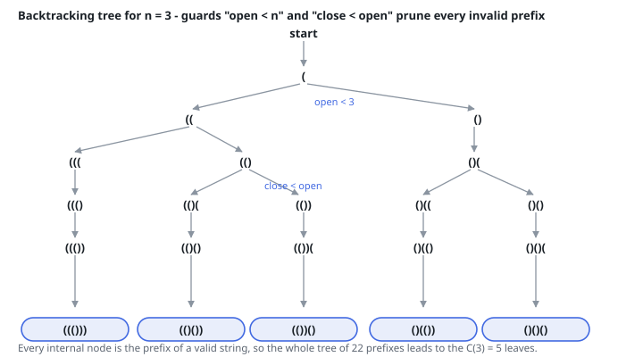

# Solutions — Generate Parentheses

## Backtracking on prefix validity

Build the string one character at a time and only ever extend a prefix that could still grow into a well-formed string. Two counters decide that: a `(` may be appended while fewer than `n` opening brackets have been placed, and a `)` may be appended only while closings still trail openings (`close_count < open_count`) — appending it can never make the prefix invalid. Under these two guards every leaf reached at length `2n` is well-formed by construction, so the code never has to validate anything after the fact.

The recursion shares one mutable character list: it appends, recurses, and pops, so the path itself is the working storage and each completed combination is frozen with a single `join`. Trying `(` before `)` at every step enumerates the leaves in lexicographic order (with `'(' < ')'`), matching the required output order for free. Every internal node of the recursion tree is a prefix of some valid string, so all work goes toward output — the tree has exactly the Catalan number `C(n)` leaves and nothing is generated then discarded.

The number of well-formed strings, and of the prefixes the tree explores, grows as the Catalan numbers — asymptotically `4^n / √n` — and the recursion plus the shared path never exceeds `n` characters of working storage.

**Complexity:** `O(4^n / √n)` time, `O(n)` space.
