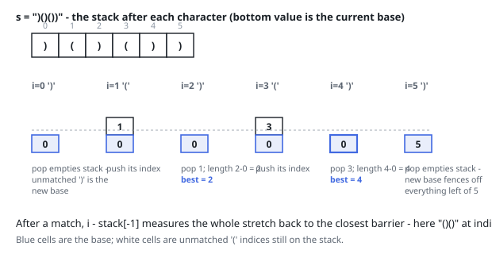

# Solutions — Longest Valid Parentheses

## Index stack with a sentinel base

Keep a stack of indices, seeded with `-1` as a sentinel "base": the position just before the current candidate stretch. Scan the string once. The index of every `(` is pushed, so the stack always holds the still-unmatched opening brackets in order, with the base (or an unmatched `)` acting as the new base) sitting beneath them.

On a `)`, pop. If the pop empties the stack, this closer is unmatched — it can never sit inside a valid substring, so its own index becomes the new base, fencing off everything to its left. Otherwise the popped index was the `(` matching this `)`, and the top of the stack now names the closest barrier _before_ the valid stretch that ends here: `i - stack[-1]` is that stretch's full length, tracked against the best. Because interior barriers only disappear by being matched, adjacent valid stretches separated by a now-matched `(` automatically measure as one stretch — in `"()()"` the second match pops the `(` at index 2 and exposes the original `-1` base, yielding 4, not 2.

Edge cases fall out of the mechanics: the empty string never enters the loop (answer 0), leading `)` characters just keep resetting the base, and a string of only `(` leaves `best` at 0 since no closer ever pops anything. One pass with constant work per character decides the time; the stack is the only auxiliary structure and can hold up to `n` indices when the string is all opening brackets.

**Complexity:** `O(n)` time, `O(n)` space.
