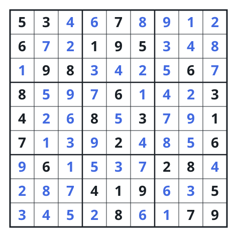

# Sudoku Solver

## Description

Write a program to solve a Sudoku puzzle by filling the empty cells.

A sudoku solution must satisfy all of the following rules:

- Each of the digits `1-9` must occur exactly once in each row.
- Each of the digits `1-9` must occur exactly once in each column.
- Each of the digits `1-9` must occur exactly once in each of the 9 `3x3`
  sub-boxes of the grid.

The `'.'` character indicates empty cells.

Fill the board in place and return the solved board.

### Example 1

```text
Input: board = [["5","3",".",".","7",".",".",".","."],["6",".",".","1","9","5",".",".","."],[".","9","8",".",".",".",".","6","."],["8",".",".",".","6",".",".",".","3"],["4",".",".","8",".","3",".",".","1"],["7",".",".",".","2",".",".",".","6"],[".","6",".",".",".",".","2","8","."],[".",".",".","4","1","9",".",".","5"],[".",".",".",".","8",".",".","7","9"]]
Output: [["5","3","4","6","7","8","9","1","2"],["6","7","2","1","9","5","3","4","8"],["1","9","8","3","4","2","5","6","7"],["8","5","9","7","6","1","4","2","3"],["4","2","6","8","5","3","7","9","1"],["7","1","3","9","2","4","8","5","6"],["9","6","1","5","3","7","2","8","4"],["2","8","7","4","1","9","6","3","5"],["3","4","5","2","8","6","1","7","9"]]
Explanation: The input board is the puzzle above, and the only valid solution
is the output board.
```



### Constraints

- `board.length == 9`
- `board[i].length == 9`
- `board[i][j]` is a digit or `'.'`.
- It is guaranteed that the input board has only one solution.

## Hints

### Hint 1

For each empty cell, place a valid number and try solving for the remaining empty cells.

### Hint 2

If stuck, undo (backtrack) and try another valid number.

### Hint 3

Track used digits per row, column, and 3x3 box with sets or bitmasks so validity checks are O(1).
