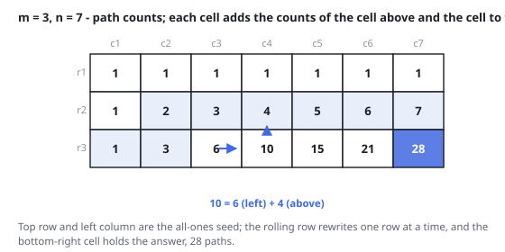

# Solutions — Unique Paths

Two equivalent ways to count monotone lattice paths: fold the grid's
additive recurrence into one rolling row, or recognize that a path is
just an arrangement of moves and count the arrangements directly with a
binomial coefficient.

## dp

The number of paths into a cell obeys the recurrence
`paths(r, c) = paths(r - 1, c) + paths(r, c - 1)`, because a robot arrives
only from above or from the left. Every cell of the top row and the left
column admits exactly one path — a straight run of moves — and that is all
the seeding the table needs. Instead of materializing the full `m x n`
grid, the code keeps a single row: it starts as all ones (the path counts
of the first row) and is rewritten in place once for each remaining row.

The in-place update works because of evaluation order. When column `j` is
being computed, `row[j]` still holds the count from the row above, while
`row[j - 1]` was already overwritten earlier in this pass and therefore
holds the current row's left neighbor. So `row[j] += row[j - 1]` applies
the recurrence exactly, drawing its two operands from the two directions
the robot could have come from. Each left-to-right pass folds one more row
of the classic two-dimensional table into the same `n` slots, and after
`m - 1` passes `row[-1]` is the count for the bottom-right corner.

Degenerate grids fall out of the loop bounds rather than needing special
cases: when `m == 1` the outer loop never runs, and when `n == 1` the inner
range is empty, so in either case the row stays all ones and the returned
`row[-1]` is `1` — a single row or column has exactly one path. With `m, n <= 100` the answer stays under `2 * 10^9`, as
the statement guarantees, and Python integers handle it exactly.

**Complexity:** `O(m * n)` time, `O(n)` space.

## combinatorics

A path from the top-left to the bottom-right corner consists of exactly `m - 1` down moves and `n - 1` right moves — `m + n - 2` moves total — and any two paths differ only in the order of those moves. Counting paths is therefore counting the arrangements of a multiset with two kinds of indistinguishable moves: choosing which `m - 1` of the `m + n - 2` slots hold the downs determines the path completely, giving `C(m + n - 2, m - 1)`.

The code evaluates that binomial with the multiplicative formula rather than factorials: multiply by `(big - small + j)` and divide by `j` for `j = 1..small`, where `small` is the smaller of `m - 1` and `n - 1` (by symmetry `C(N, K) = C(N, N - K)`, so the shorter side wins). After step `j` the running value is exactly `C(big - small + j, j)`, which is always an integer — so every division is exact and no huge intermediate factorial is ever formed. The fixed languages widen the running product (`long`, `long long`, `int64`) because the product before a division can exceed the final answer; JavaScript and Python need no widening, the values staying far below the exact-integer range of a double.

Degenerate shapes collapse without special cases: `m == 1` or `n == 1` makes `small` zero, the loop body never runs, and the result is the initial `1` — the single straight path.

**Complexity:** `O(min(m, n))` time, `O(1)` space.
