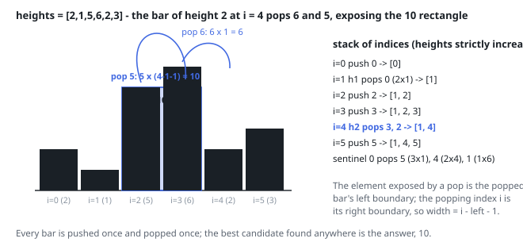

# Solutions — Largest Rectangle in Histogram

## Monotonic Stack

For any bar, the widest rectangle that uses that bar at its full height stretches from the nearest strictly shorter bar on its left to the nearest strictly shorter bar on its right. If we could find those two boundaries for every bar, the answer would be the maximum of `height[i] * width` over all bars. The brute-force way of scanning outward per bar is O(n²), so instead we determine both boundaries implicitly, in a single left-to-right pass.

The solution keeps a stack of indices whose heights are strictly increasing. When the current bar `h` is taller than (or equal to) the bar on top of the stack, the current bar cannot yet be a right boundary for anything, so its index is simply pushed. The moment a shorter bar arrives, every bar on the stack taller than `h` has just found its right boundary: the current index `i`. Each such bar is popped, and its left boundary is the index now on top of the stack (the nearest bar that is still strictly shorter than it), or `-1` if the stack is empty, meaning the rectangle extends all the way to the start of the array. The width is then `i - left - 1`, and the candidate area `height * width` updates the running best.

Every bar is pushed exactly once and popped at most once, so the whole scan is linear even though the inner loop looks nested. Equal heights are handled correctly by the strict `>` comparison: an equal bar is pushed rather than popped, and when the run is finally flushed, the earlier bar of an equal pair computes the full width of the run because its left boundary is the nearest strictly shorter bar, not the equal neighbor.

A sentinel bar of height `0` appended to the iteration (`heights + [0]`) guarantees that every bar still on the stack is popped and evaluated by the time the loop ends — the sentinel is shorter than everything, so it flushes the stack without ever contributing a positive area itself. Bars of height `0` and a single-element array fall out naturally: they produce zero-width or zero-height candidates and never beat `best`, which starts at `0`.

**Complexity:** `O(n)` time, `O(n)` space.
