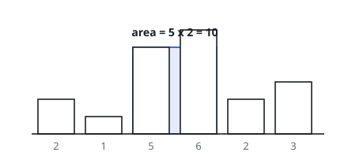
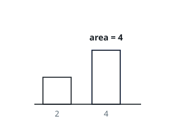

# Largest Rectangle in Histogram

## Description

Given an array of integers `heights` representing the histogram's bar
heights where the width of each bar is `1`, return the area of the largest
rectangle in the histogram.

### Example 1

```text
Input: heights = [2,1,5,6,2,3]
Output: 10
Explanation: The largest rectangle has height 5 and spans two bars, for an area of 10.
```



### Example 2

```text
Input: heights = [2,4]
Output: 4
```



### Constraints

- `1 <= heights.length <= 10⁵`
- `0 <= heights[i] <= 10⁴`

## Hints

### Hint 1

For each bar, the widest rectangle using it at full height extends to the nearest shorter bar on the left and on the right.

### Hint 2

Maintain a stack of indices with increasing heights; when a shorter bar arrives, pop bars and compute their areas using the popped height.

### Hint 3

The width available to a popped bar runs between the new stack top and the current index; a sentinel 0 at the end flushes the stack.
