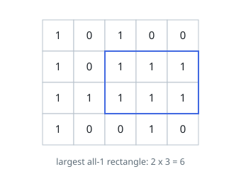

# Maximal Rectangle

## Description

Given a `rows x cols` binary matrix filled with `0`'s and `1`'s, find the
largest rectangle containing only `1`'s and return its area.

### Example 1

```text
Input: matrix = [["1","0","1","0","0"],["1","0","1","1","1"],["1","1","1","1","1"],["1","0","0","1","0"]]
Output: 6
Explanation: The maximal rectangle of 1's has area 6.
```



### Example 2

```text
Input: matrix = [["0"]]
Output: 0
```

### Example 3

```text
Input: matrix = [["1"]]
Output: 1
```

### Constraints

- `rows == matrix.length`
- `cols == matrix[i].length`
- `1 <= rows, cols <= 200`
- `matrix[i][j]` is `'0'` or `'1'`.

## Hints

### Hint 1

Treat each row as the base of a histogram: a running heights array grows by 1 on a '1' and resets to 0 on a '0'.

### Hint 2

For every row, solve the largest-rectangle-in-histogram problem on those running heights.

### Hint 3

The answer is the maximum rectangle over all rows — any rectangle of 1's ends at some row and is a histogram rectangle there.
