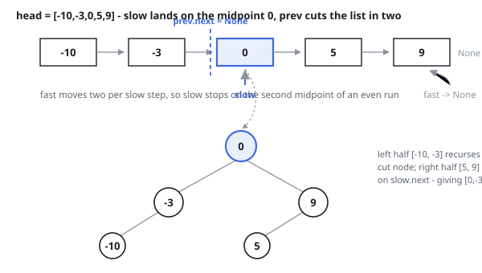

# Solutions — Convert Sorted List to Binary Search Tree

Two equivalent builds. Both make the middle of every segment the root — for
an even-length segment, the second of the two middles — so both produce the
identical height-balanced tree; they differ only in how they find that
middle.

## Fast/slow

In a sorted segment, the middle element is the only choice of root that makes both sides a BST and keeps them as equal in size as possible — so recursing on the two halves around it yields a height-balanced tree. The nodes before the middle form the left subtree, the nodes after it the right.

Because the input is a singly linked list, the middle is found by walking two pointers: `slow` advances one node per step, `fast` two, and when `fast` runs past the end `slow` has stopped on the midpoint. With the loop guarded by `fast and fast.next`, an even-length segment leaves `slow` on the second of the two middle nodes, matching the required tie-break. A third pointer `prev` trails `slow` so `prev.next = None` can cut the list in two; the recursion then treats `node` and `slow.next` as independent list heads.

Empty segments (`node is None`) return `None`, and a one-node segment is turned directly into a leaf before the pointer walk — which also matters for safety, since with a single node `prev` would still be `None` when the cut happens. (The Rust port flattens the list into an array once and runs the same two-pointer walk on indices — safe Rust cannot hold the aliasing pointers a linked-list walk needs.)

**Complexity:** `O(n log n)` time, `O(log n)` space — each call scans its whole segment (`T(n) = 2T(n/2) + Θ(n)`), while the recursion depth is the height of the balanced tree being built and the cuts reuse the input nodes in place.

## Inorder simulation

A sorted list read in order is exactly the inorder traversal of the target tree, so the tree can be grown directly in that order: a cursor walks the list once while the recursion claims nodes precisely where an inorder insertion would put them. For a segment of n nodes the left subtree takes the first ⌊n / 2⌋ of them, the next node in original order becomes the root, and the right subtree takes the remainder — the same middles the midpoint walk picks, hence the identical tree.

One sizing pass counts the nodes first (the recursion needs the counts to know where each middle falls), then a single recursive build consumes the list: descend left, claim the cursor's node as the root and step the cursor forward, descend right. Every node is claimed exactly once and none is visited twice, so unlike the midpoint walk nothing is rescanned.

**Complexity:** `O(n)` time, `O(log n)` space for the recursion depth — the height of the tree being built.
