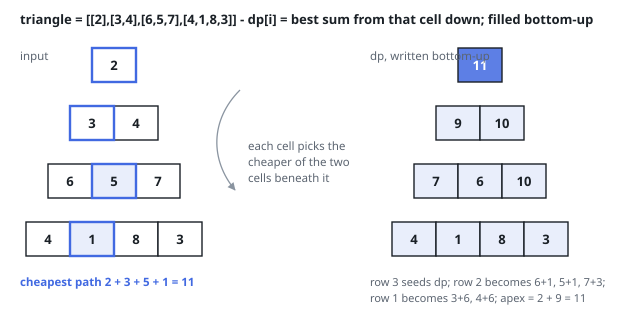

# Solutions — Triangle

The same recurrence read in two directions: sweep upward from the base
collapsing children into parents, or sweep downward from the apex growing
prefix paths row by row. Both fold the triangle into a single rolling row
of path sums; they differ only in which edge of the recursion does the
work and which row ends up holding the answer.

## bottom_up

Working from the last row upward removes every boundary case. Let `dp[i]`
be the minimum path sum from column `i` of the current row down to the
bottom; the last row initializes `dp` with its own values, since a path
starting there is just that cell. For each row above, a cell at index `i`
may step to `i` or `i + 1` below, so its best continuation is its own
value plus the smaller of the two sums already computed beneath it, and
`dp` shrinks by one entry per row until only `dp[0]` — the answer at the
apex — remains.

A single rolling array is enough because each row only reads the row
below it. Updating `dp[i]` in place with `i` ascending is safe: it reads
`dp[i]` and `dp[i + 1]`, and index `i + 1` has not been overwritten yet
when it is read. The bottom-up direction also sidesteps the ragged edge
cells that a top-down sweep would have to special-case, where a cell has
one parent instead of two.

A one-row triangle never enters the loop and returns its only value
directly, and negative entries cause no trouble — the recurrence takes
the minimum regardless of sign.

**Complexity:** `O(n²)` time, `O(n)` space, for `n` rows — every one of
the `n(n+1)/2` cells is folded in once, and the rolling `dp` array holds
at most one row.

## top_down

Start at the apex and ask the opposite question: `best[i]` is the minimum
path sum of any descent from the top down to column `i` of the current
row. The apex seeds `best` with its single value, and each row below
reads the row above it: an interior cell at index `i` descends from `i-1`
or `i`, so it takes its own value plus the smaller of those two sums.
Where the bottom-up sweep had to merge two children per cell, the
top-down sweep must instead special-case the two ragged edges — the first
cell of a row has only the parent above it, and the last cell has only
the parent to its upper-left — which is why the code writes those two
cells explicitly around the interior loop.

Because each row now grows by one entry rather than shrinking, the
implementation builds a fresh row per level instead of overwriting in
place; both rows together still never exceed one triangle row, so the
space bound is the same. The direction flips where the answer is read,
too: instead of everything collapsing into `dp[0]` at the apex, the
finished sweep leaves the best path to every cell of the last row, and
the answer is the minimum among them.

A one-row triangle never enters the loop and returns the apex directly,
and negative entries behave exactly as in the bottom-up version — the
recurrence compares sums, never assuming they are positive.

**Complexity:** `O(n²)` time, `O(n)` space — one pass per cell, and the
current and previous row are the only state.
