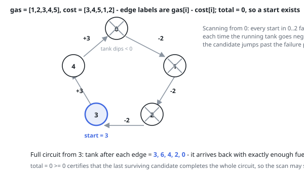

# Solutions — Gas Station

## Greedy Single Pass with Tank Reset

Sum every per-station surplus `diff = gas[i] - cost[i]` into `total` while scanning. If the total is negative there is simply not enough fuel in the system to drive the whole circuit, so no starting station can succeed and the answer is -1. When the total is non-negative a solution exists and is unique by the problem's guarantee, and one pass finds it.

The pass keeps a running `tank` measured from the current candidate `start`. The moment the tank dips below zero at station i, every station from `start` through i is disqualified in one stroke: restarting anywhere inside that stretch forfeits the (non-negative) surplus the failed start had accumulated up to that point, so an intermediate start arrives at station i with even less fuel. The candidate therefore jumps to `i + 1` and the tank resets to zero.

When the scan ends, `start` is the answer — the total-surplus check already certifies that the final candidate can carry through the remainder. A single-station circuit returns index 0 whenever `gas[0] >= cost[0]`, and the negative-total case correctly overrides any candidate when the loop as a whole is infeasible.

**Complexity:** `O(n)` time, `O(1)` space.
