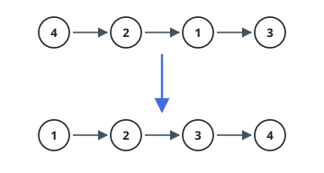
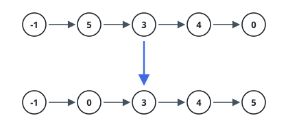

# Sort List

## Description

Given the `head` of a linked list, return the list after sorting it in
ascending order.

### Example 1

```text
Input: head = [4,2,1,3]
Output: [1,2,3,4]
```



### Example 2

```text
Input: head = [-1,5,3,4,0]
Output: [-1,0,3,4,5]
```



### Example 3

```text
Input: head = []
Output: []
```

### Constraints

- The number of nodes in the list is in the range `[0, 5 * 10^4]`.
- `-10^5 <= Node.val <= 10^5`

Follow up: Can you sort the linked list in `O(n log n)` time and `O(1)`
memory (i.e. constant space)?

## Hints

### Hint 1

Merge sort fits linked lists naturally: split the list in half, sort each half recursively, then merge the two sorted halves.

### Hint 2

Find the midpoint with slow/fast pointers; start the fast pointer one step ahead so the halves split evenly and the recursion terminates.

### Hint 3

Merge with a dummy head, repeatedly appending the smaller front node of the two halves.
