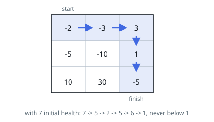

# Dungeon Game

## Description

The demons had captured the princess and imprisoned her in the bottom-right
corner of a dungeon. The dungeon consists of `m x n` rooms laid out in a 2D
grid. Our valiant knight was initially positioned in the top-left room and
must fight his way through the dungeon to rescue the princess.

The knight has an initial health point represented by a positive integer. If
at any point his health point drops to `0` or below, he dies immediately.

Some of the rooms are guarded by demons (represented by negative integers), so
the knight loses health upon entering these rooms; other rooms are either
empty (represented as `0`) or contain magic orbs that increase the knight's
health (represented by positive integers).

To reach the princess as quickly as possible, the knight decides to move only
rightward or downward in each step.

Return the knight's minimum initial health so that he can rescue the princess.

Note that any room can contain threats or power-ups, even the first room the
knight enters and the bottom-right room where the princess is imprisoned.

### Example 1

```text
Input: dungeon = [[-2,-3,3],[-5,-10,1],[10,30,-5]]
Output: 7
Explanation: The initial health of the knight must be at least 7 if he
follows the optimal path RIGHT -> RIGHT -> DOWN -> DOWN.
```



### Example 2

```text
Input: dungeon = [[0]]
Output: 1
```

### Constraints

- `m == dungeon.length`
- `n == dungeon[i].length`
- `1 <= m, n <= 200`
- `-1000 <= dungeon[i][j] <= 1000`

## Hints

### Hint 1

Work backwards from the princess's room: compute the minimum health needed when entering each cell.

### Hint 2

need[i][j] = max(1, min(need[i+1][j], need[i][j+1]) - dungeon[i][j]); health must stay at least 1 after every room.

### Hint 3

Seed the recurrence so that leaving the bottom-right room requires at least 1 health; the answer is need[0][0].
