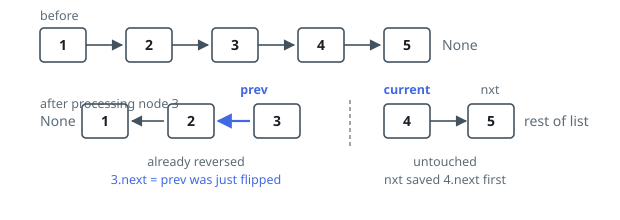

# Solutions — Reverse Linked List

Two equivalent reversals: both walk the list once and relink the original
nodes in place, producing the same chain read backwards. They differ in
whether the work is driven by a loop with three pointers or consumed by the
call stack — and the stack is exactly where their costs diverge.

## Iterative

The list is reversed in place by walking it once and flipping one `next` pointer at a time. Three references carry the state: `prev` is the already-reversed portion's head (initially `None`), `current` is the node being processed, and `nxt` temporarily holds the rest of the list.

The loop's four steps are ordered to protect the only fragile operation: `nxt = current.next` must save the forward link _before_ `current.next = prev` overwrites it, or the remainder of the list would be lost. After the pointer flips, `prev` advances to the newly reversed node and `current` steps to the saved successor. Invariant: at the top of each iteration, the chain behind `prev` is fully reversed and the chain ahead of `current` is untouched.

When `current` becomes `None` the whole list has been consumed and `prev` points at the original tail, which is the new head and the return value. An empty list never enters the loop and returns `None` unchanged; a single node gets its `next` set to `None` (already the case) and is returned as is.

**Complexity:** `O(n)` time, `O(1)` space.

## Recursive

Reverse the tail first, then hang the head behind it. The base case is a missing head or a last node — already reversed, it is its own new head. Otherwise the recursive call on `head.next` returns the head of the reversed remainder, and two pointer writes finish the job for this node: `head.next.next = head` points the remainder's first node back at head, then `head.next = None` severs head's old forward link so it becomes the tail. The new head travels back up the chain unchanged from the deepest call.

Every node is touched once and nothing is allocated, but the call stack grows one frame per node — the price the iterative version refuses to pay. The ports tune that depth to their runtimes: Python raises the recursion limit first (the list may hold 5000 nodes, past CPython's default), Rust threads the already-reversed prefix as an accumulator parameter (the classic link-back step needs two live references into one node, which safe Rust cannot hold), and the JavaScript/TypeScript judge caps the call stack below the 5000-node limit, so those two ports halve the list instead — recursively reverse each half and join them in swapped order, which keeps the depth logarithmic at the cost of `O(n log n)` walking.

**Complexity:** `O(n)` time, `O(n)` space for the call stack — the JS/TS ports halve for `O(log n)` depth at `O(n log n)` time.
