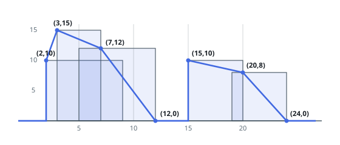

# Solutions — The Skyline Problem

## Sweep Line with a Lazy Max-Heap

At any x-coordinate the skyline's height is simply the tallest building whose span still covers that x, so the solution sweeps building edges left to right and maintains the set of _active_ buildings. Active heights live in a max-heap keyed by negative height; the heap top is the current contour height, and a ground sentinel `(0, inf)` ensures the top is always defined even when no building covers the sweep point.

Each building contributes two events — a start at its left edge and an end at its right edge — and plain tuple sorting encodes all the tie-breaking rules: at equal x, start events (`kind 0`) sort before end events (`kind 1`) so adjacent buildings hand off the contour without a spurious dip to ground, taller starts come first (via `-height`) so the higher silhouette is recorded, and shorter ends come first so a tall building survives until its own right edge. Instead of eagerly removing ended buildings from the middle of the heap, the sweep lazily pops any top entry whose `right <= x` before handling each event; stale entries below the top are harmless and get discarded when they eventually surface.

After processing an event's push (starts) or pops (ends), the code reads the heap top as the current height and appends a key point `[x, height]` only when the height differs from the previous key point's height — this single comparison merges consecutive segments of equal height, as the output format demands. The final drop to the skyline's terminator is automatic: once the last building ends, the lazy pops expose the ground sentinel and a closing point at height 0 is emitted.

**Complexity:** `O(B log B)` time, `O(B)` space.
