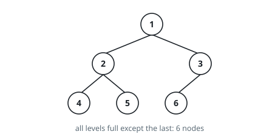

# Count Complete Tree Nodes

## Description

Given the `root` of a complete binary tree, return the number of the nodes in
the tree.

According to the definition of a complete binary tree, every level, except
possibly the last, is completely filled, and all nodes in the last level are
as far left as possible.

Design an algorithm that runs in less than `O(n)` time complexity.

### Example 1

```text
Input: root = [1,2,3,4,5,6]
Output: 6
```



### Example 2

```text
Input: root = []
Output: 0
```

### Example 3

```text
Input: root = [1]
Output: 1
```

### Constraints

- The number of nodes in the tree is in the range `[0, 5 * 10^4]`.
- `0 <= Node.val <= 5 * 10^4`
- The tree is guaranteed to be complete.

## Hints

### Hint 1

Measure the height of the leftmost path and of the rightmost path from the root; if they are equal, the tree is perfect and holds exactly 2^h - 1 nodes.

### Hint 2

If the heights differ, recurse into both subtrees: the count is 1 + count(left) + count(right).

### Hint 3

At each level at least one of the two subtrees is perfect, so the algorithm runs in O(log^2 n).
