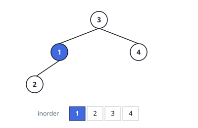
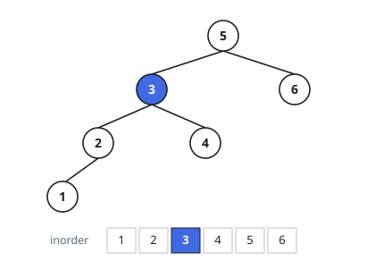

# Kth Smallest Element in a BST

## Description

Given the root of a binary search tree, and an integer `k`, return the kth
smallest value (1-indexed) of all the values of the nodes in the tree.

### Example 1

```text
Input: root = [3,1,4,null,2], k = 1
Output: 1
```



### Example 2

```text
Input: root = [5,3,6,2,4,null,null,1], k = 3
Output: 3
```



### Constraints

- The number of nodes in the tree is `n`.
- `1 <= k <= n <= 10^4`
- `0 <= Node.val <= 10^4`

Follow up: If the BST is modified often (i.e., we can do insert and delete
operations) and you need to find the kth smallest frequently, how would you
optimize?

## Hints

### Hint 1

Try to utilize the ordering property of a BST.

### Hint 2

Try in-order traversal: it visits the values in sorted order.

### Hint 3

What if you could modify the BST node's structure to cache subtree sizes?

### Hint 4

The optimal runtime complexity is O(height of BST).
