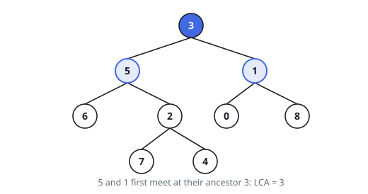
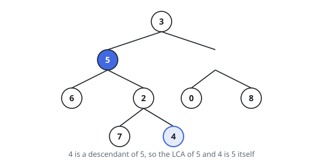

# Lowest Common Ancestor of a Binary Tree

## Description

Given a binary tree, find the lowest common ancestor (LCA) of two given nodes
in the tree.

According to the definition of LCA on Wikipedia: "The lowest common ancestor
is defined between two nodes p and q as the lowest node in T that has both p
and q as descendants (where we allow a node to be a descendant of itself)."

In this judge, `p` and `q` are given as node values, and you should return the
value of the lowest common ancestor node.

### Example 1

```text
Input: root = [3,5,1,6,2,0,8,null,null,7,4], p = 5, q = 1
Output: 3
Explanation: The LCA of nodes 5 and 1 is 3.
```



### Example 2

```text
Input: root = [3,5,1,6,2,0,8,null,null,7,4], p = 5, q = 4
Output: 5
Explanation: The LCA of nodes 5 and 4 is 5, since a node can be a descendant
of itself according to the LCA definition.
```



### Example 3

```text
Input: root = [1,2], p = 1, q = 2
Output: 1
```

### Constraints

- The number of nodes in the tree is in the range `[2, 10^5]`.
- `-10^9 <= Node.val <= 10^9`.
- All `Node.val` are unique.
- `p != q`
- `p` and `q` will exist in the tree.

## Hints

### Hint 1

Without a search-tree ordering, a node's value tells you nothing about which
subtree holds the targets — you have to search the whole subtree to know.

### Hint 2

Write a recursion that reports, for each subtree, whether it contains p or q —
returning the found target node itself, and nothing when neither is present.

### Hint 3

At a node where the left search and the right search each return a target, the
two targets meet: that node is the LCA. If the node's own value is p or q,
return it immediately — a node counts as a descendant of itself.
