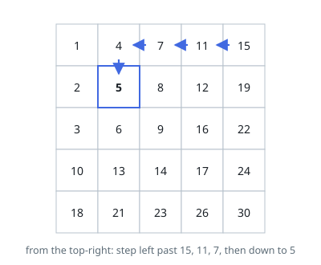
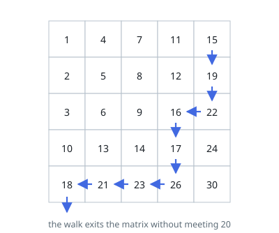

# Search a 2D Matrix II

## Description

Write an efficient algorithm that searches for a value `target` in an
`m x n` integer matrix `matrix`. This matrix has the following properties:

- Integers in each row are sorted in ascending from left to right.
- Integers in each column are sorted in ascending from top to bottom.

### Example 1

```text
Input: matrix = [[1,4,7,11,15],[2,5,8,12,19],[3,6,9,16,22],[10,13,14,17,24],[18,21,23,26,30]], target = 5
Output: true
```



### Example 2

```text
Input: matrix = [[1,4,7,11,15],[2,5,8,12,19],[3,6,9,16,22],[10,13,14,17,24],[18,21,23,26,30]], target = 20
Output: false
```



### Constraints

- `m == matrix.length`
- `n == matrix[i].length`
- `1 <= n, m <= 300`
- `-10^9 <= matrix[i][j] <= 10^9`
- All the integers in each row are sorted in ascending order.
- All the integers in each column are sorted in ascending order.
- `-10^9 <= target <= 10^9`

## Hints

### Hint 1

Start from the top-right corner: it is the largest value in its row and the smallest in its column.

### Hint 2

If the current value is larger than the target, the whole column can be discarded; if it is smaller, the whole row can be discarded — one row or column eliminated per step.

### Hint 3

This staircase walk takes O(m + n); binary-searching every row is O(m log n) and slower in the worst case.
