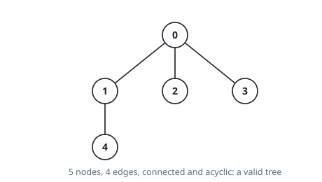
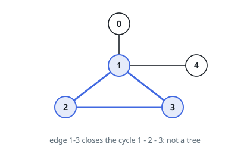

# Graph Valid Tree

## Description

You have a graph of `n` nodes labeled from `0` to `n - 1`. You are given an
integer `n` and a list of `edges` where `edges[i] = [ai, bi]` indicates that
there is an undirected edge between nodes `ai` and `bi` in the graph.

Return `true` if the edges of the given graph make up a valid tree, and
`false` otherwise.

### Example 1

```text
Input: n = 5, edges = [[0,1],[0,2],[0,3],[1,4]]
Output: true
```



### Example 2

```text
Input: n = 5, edges = [[0,1],[1,2],[2,3],[1,3],[1,4]]
Output: false
```



### Constraints

- `1 <= n <= 2000`
- `0 <= edges.length <= 5000`
- `edges[i].length == 2`
- `0 <= ai, bi < n`
- `ai != bi`
- There are no self-loops or repeated edges.

## Hints

### Hint 1

A tree on n nodes must have exactly n - 1 edges and be connected — if the edge count differs you can answer immediately.

### Hint 2

A tree is an undirected graph in which any two vertices are connected by exactly one path: connected and acyclic.

### Hint 3

Union-Find is a natural fit: merge endpoints edge by edge, and report failure the moment an edge joins two nodes already in the same component (a cycle).
