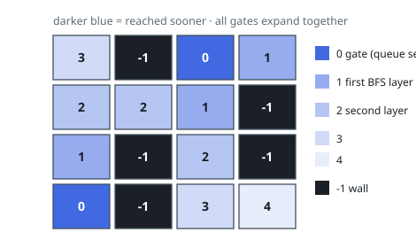

# Solutions — Walls and Gates

## Multi-Source BFS

Instead of searching from every empty room to its nearest gate (which repeats work), the solution inverts the direction: it enqueues all gates at once and runs a single breadth-first search outward through the grid. Because BFS explores in layers of increasing distance, the first time any empty room is reached is along a shortest path from some gate, so that visit distance is exactly the room's nearest-gate distance.

The queue is seeded with every cell holding `0`, and a `dist` counter starts at 0. Each loop iteration increments `dist` and expands the entire current layer, writing the layer's distance into every unvisited empty room it touches. A room counts as unvisited exactly when its value still equals `INF`, so writing the distance doubles as the visited mark — no separate visited set is needed. Walls (`-1`) and gates (`0`) never match `INF`, so they are never overwritten and never traversed into.

Processing a whole layer per step is what makes the distances correct: all cells at distance `d` are fully discovered before any cell at distance `d + 1` is labeled, which is the invariant BFS depends on. Since every cell enters the queue at most once, the whole sweep touches each of the `m · n` cells a constant number of times.

Edge cases: a grid with no gates simply never expands and returns unchanged, leaving unreachable rooms at `INF` as specified. A grid that is only walls or only gates is returned untouched, and a single-cell grid works trivially.

**Complexity:** `O(m·n)` time, `O(m·n)` space.
