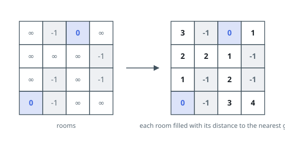

# Walls and Gates

## Description

You are given an `m x n` grid `rooms` initialized with these three possible
values.

- `-1` A wall or an obstacle.
- `0` A gate.
- `INF` Infinity means an empty room. We use the value `2^31 - 1 = 2147483647`
  to represent `INF` as you may assume that the distance to a gate is less
  than 2147483647.

Fill each empty room with the distance to its nearest gate. If it is
impossible to reach a gate, it should be filled with `INF`. Return the
resulting grid.

### Example 1

```text
Input: rooms = [[2147483647,-1,0,2147483647],[2147483647,2147483647,2147483647,-1],[2147483647,-1,2147483647,-1],[0,-1,2147483647,2147483647]]
Output: [[3,-1,0,1],[2,2,1,-1],[1,-1,2,-1],[0,-1,3,4]]
```



### Example 2

```text
Input: rooms = [[-1]]
Output: [[-1]]
```

### Constraints

- `m == rooms.length`
- `n == rooms[i].length`
- `1 <= m, n <= 250`
- `rooms[i][j]` is `-1`, `0`, or `2^31 - 1`.

## Hints

### Hint 1

A multi-source BFS that starts from all gates at once gives every room its nearest-gate distance.

### Hint 2

Enqueue every gate before the first step; each empty room is first reached along a shortest path, so record the distance the moment you visit it.

### Hint 3

Walls (-1) and gates (0) are never updated; rooms unreachable from any gate keep the value INF.
