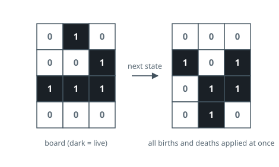
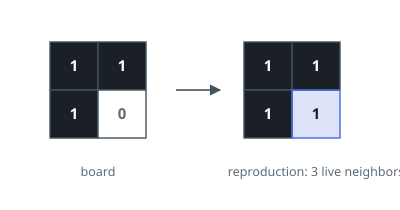

# Game of Life

## Description

According to Wikipedia's article: "The Game of Life, also known simply as
Life, is a cellular automaton devised by the British mathematician John Horton
Conway in 1970."

The board is made up of an `m x n` grid of cells, where each cell has an
initial state: live (represented by a `1`) or dead (represented by a `0`).
Each cell interacts with its eight neighbors (horizontal, vertical, diagonal)
using the following four rules:

- Any live cell with fewer than two live neighbors dies, as if caused by
  under-population.
- Any live cell with two or three live neighbors lives on to the next
  generation.
- Any live cell with more than three live neighbors dies, as if by
  over-population.
- Any dead cell with exactly three live neighbors becomes a live cell, as if
  by reproduction.

The next state of the board is determined by applying the above rules
simultaneously to every cell in the current state of the `m x n` grid board.
In this process, births and deaths occur simultaneously.

Given the current state of the board, update the board to reflect its next
state, and return the resulting board.

### Example 1

```text
Input: board = [[0,1,0],[0,0,1],[1,1,1],[0,0,0]]
Output: [[0,0,0],[1,0,1],[0,1,1],[0,1,0]]
```



### Example 2

```text
Input: board = [[1,1],[1,0]]
Output: [[1,1],[1,1]]
```



### Constraints

- `m == board.length`
- `n == board[i].length`
- `1 <= m, n <= 25`
- `board[i][j]` is `0` or `1`.

Follow up:

- Could you solve it in-place? Remember that the board needs to be updated
  simultaneously: you cannot update some cells first and then use their
  updated values to update other cells.
- In this question, we represent the board using a 2D array. In principle,
  the board is infinite, which would cause problems when the active area
  encroaches upon the border of the array (i.e., live cells reach the border).
  How would you address these problems?

## Hints

### Hint 1

All births and deaths happen simultaneously, so a cell's next state must be computed from the old states of its neighbors.

### Hint 2

You can encode the next state in place with intermediate markers (for example 2 = was live, now dead and 3 = was dead, now live) and normalize the board in a second pass.

### Hint 3

Count live neighbors among the eight surrounding cells, treating anything outside the board as dead.
