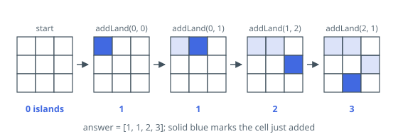

# Number of Islands II

## Description

You are given an empty 2D binary grid of size `m x n`. The grid represents a
map where `0`'s represent water and `1`'s represent land. Initially, all the
cells of the grid are water cells (i.e., all the cells are `0`'s).

We may perform an add land operation which turns the water at a position into
a land. You are given an array `positions` where `positions[i] = [ri, ci]` is
the position `(ri, ci)` at which we should perform the `i`th operation.

Return an array of integers `answer` where `answer[i]` is the number of
islands after turning the cell `(ri, ci)` into a land.

An island is surrounded by water and is formed by connecting adjacent lands
horizontally or vertically. You may assume all four edges of the grid are all
surrounded by water.

### Example 1

```text
Input: m = 3, n = 3, positions = [[0,0],[0,1],[1,2],[2,1]]
Output: [1,1,2,3]
Explanation: Initially, the 2D grid is filled with water.
- Operation 1: addLand(0, 0) turns the water at grid[0][0] into a land. We have 1 island.
- Operation 2: addLand(0, 1) turns the water at grid[0][1] into a land. We still have 1 island.
- Operation 3: addLand(1, 2) turns the water at grid[1][2] into a land. We have 2 islands.
- Operation 4: addLand(2, 1) turns the water at grid[2][1] into a land. We have 3 islands.
```



### Example 2

```text
Input: m = 1, n = 1, positions = [[0,0]]
Output: [1]
Explanation: The single operation fills the only cell, so the answer is one island.
```

### Constraints

- `1 <= m, n, positions.length <= 10⁴`
- `1 <= m * n <= 10⁴`
- `positions[i].length == 2`
- `0 <= ri < m`
- `0 <= ci < n`

### Follow-up

Could you solve it in time complexity `O(k log(mn))`, where `k == positions.length`?

## Hints

### Hint 1

Each add-land operation only changes one cell, so the island count changes by
a small amount — recompute nothing, update the count incrementally.

### Hint 2

Turning water into land starts a new island (+1); every distinct neighboring
island it merges with decreases the count by 1. Repeated positions change
nothing at all.

### Hint 3

Union-find with path compression and union by size answers "are these two
land cells on the same island?" in near-constant amortized time, which is
what makes the merge bookkeeping cheap.
