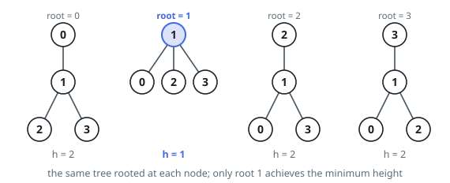
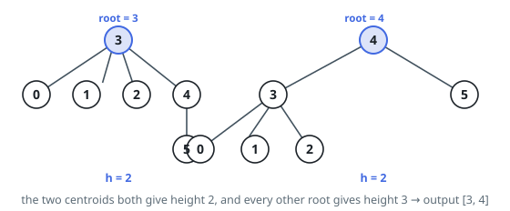

# Minimum Height Trees

## Description

A tree is an undirected graph in which any two vertices are connected by
exactly one path. In other words, any connected graph without simple cycles
is a tree.

Given a tree of `n` nodes labelled from `0` to `n - 1`, and an array of
`n - 1` edges where `edges[i] = [ai, bi]` indicates that there is an
undirected edge between the two nodes `ai` and `bi` in the tree, you can
choose any node of the tree as the root. When you select a node `x` as the
root, the result tree has height `h`. Among all possible rooted trees, those
with minimum height (i.e. `min(h)`) are called minimum height trees (MHTs).

Return a list of all MHTs' root labels. You can return the answer in any
order.

The height of a rooted tree is the number of edges on the longest downward
path between the root and a leaf.

### Example 1

```text
Input: n = 4, edges = [[1,0],[1,2],[1,3]]
Output: [1]
Explanation: As shown, the height of the tree is 1 when the root is the node with label 1 which is the only MHT.
```



### Example 2

```text
Input: n = 6, edges = [[3,0],[3,1],[3,2],[3,4],[5,4]]
Output: [3,4]
```



### Constraints

- `1 <= n <= 2 * 10^4`
- `edges.length == n - 1`
- `0 <= ai, bi < n`
- `ai != bi`
- All the pairs `(ai, bi)` are distinct.
- The given input is guaranteed to be a tree and there will be no repeated
  edges.

## Hints

### Hint 1

How many MHTs can a graph have at most? A tree always has either one or two centroids.

### Hint 2

The root of an MHT lies in the middle of the tree's longest path, so peeling away the outermost layer of leaves brings you closer to it.

### Hint 3

Repeatedly remove all current leaves simultaneously and count degrees, until only one or two nodes remain; those nodes are the answer.
