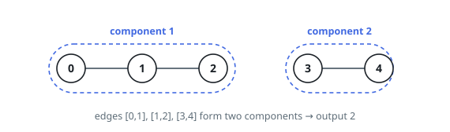
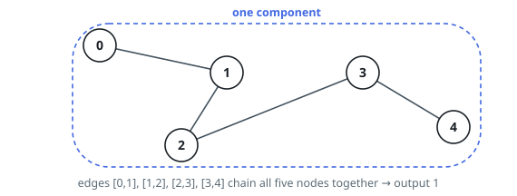

# Number of Connected Components in an Undirected Graph

## Description

You have a graph of `n` nodes. You are given an integer `n` and an
array `edges` where `edges[i] = [ai, bi]` indicates that there is an edge
between `ai` and `bi` in the graph.

Return the number of connected components in the graph.

### Example 1

```text
Input: n = 5, edges = [[0,1],[1,2],[3,4]]
Output: 2
```



### Example 2

```text
Input: n = 5, edges = [[0,1],[1,2],[2,3],[3,4]]
Output: 1
```



### Constraints

- `1 <= n <= 2000`
- `1 <= edges.length <= 5000`
- `edges[i] = [ai, bi]`
- `ai != bi`
- There are no repeated edges.

## Hints

### Hint 1

Start from n components; each edge that joins two different components reduces the count by one.

### Hint 2

Union-find (disjoint set union) with path compression processes every edge in near-constant time.

### Hint 3

Alternatively, run a DFS or BFS from every not-yet-visited node and count how many traversals you start.
