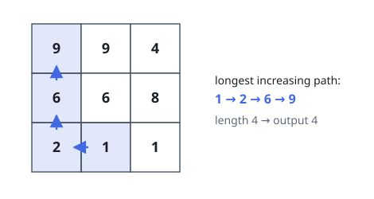
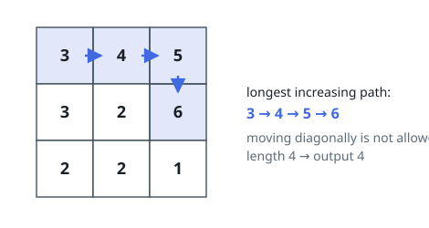

# Longest Increasing Path in a Matrix

## Description

Given an `m x n` integers `matrix`, return the length of the longest
increasing path in matrix.

From each cell, you can either move in four directions: left, right, up, or
down. You may not move diagonally or move outside the boundary (i.e.,
wrap-around is not allowed).

### Example 1

```text
Input: matrix = [[9,9,4],[6,6,8],[2,1,1]]
Output: 4
Explanation: The longest increasing path is [1, 2, 6, 9].
```



### Example 2

```text
Input: matrix = [[3,4,5],[3,2,6],[2,2,1]]
Output: 4
Explanation: The longest increasing path is [3, 4, 5, 6]. Moving diagonally is not allowed.
```



### Example 3

```text
Input: matrix = [[1]]
Output: 1
```

### Constraints

- `m == matrix.length`
- `n == matrix[i].length`
- `1 <= m, n <= 200`
- `0 <= matrix[i][j] <= 2^31 - 1`

## Hints

### Hint 1

The longest increasing path starting at a given cell is a fixed value, so memoize it instead of re-walking the same suffix.

### Hint 2

Since a path strictly increases, following it always moves to a strictly larger value: the cells form a directed acyclic graph.

### Hint 3

That acyclicity means you can fill a DP table by processing cells in increasing order of value: dp[cell] = 1 + max over smaller-valued neighbors.

### Hint 4

The answer is the maximum dp value over all cells; a single cell by itself counts as a path of length 1.
